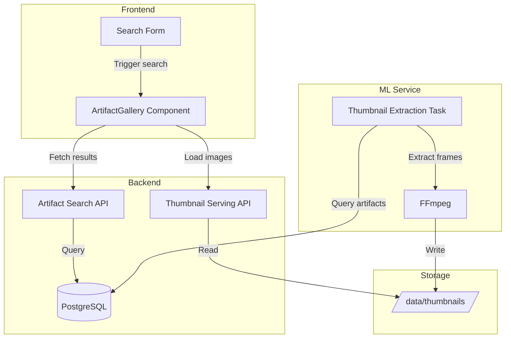
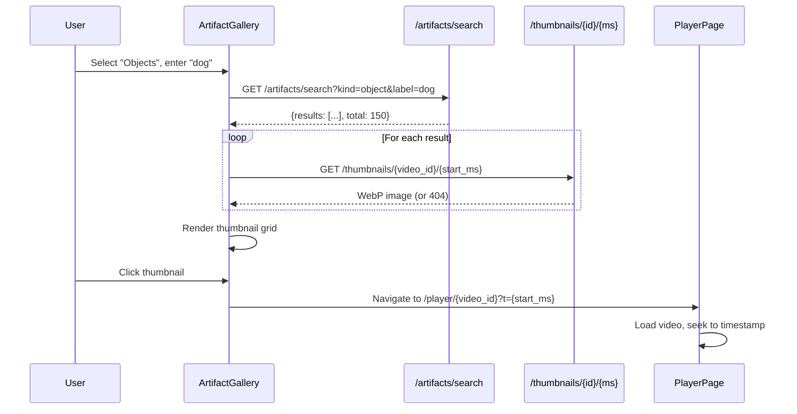

# Design Document: Artifact Thumbnails & Gallery

## Overview

This design covers two related features:
1. **Thumbnail Extraction Task**: An ML service task that generates small WebP thumbnails at artifact timestamps
2. **Artifact Gallery Search**: A paginated API and UI for browsing artifacts as a visual grid

## Architecture



## Thumbnail Extraction Task

### Task Configuration

**Task Type**: `thumbnail.extraction`
**Service**: ml-service (has ffmpeg available)
**Dependencies**: Runs after other artifact-producing tasks complete

### File Storage Structure

Thumbnails are stored in a shared Docker volume mounted at `/thumbnails` in both ml-service (writes) and backend (reads).

```
/thumbnails/
  {video_id}/
    {timestamp_ms}.webp
    {timestamp_ms}.webp
    ...
```

Example:
```
/thumbnails/
  abc-123/
    0.webp
    5000.webp
    15230.webp
    ...
```

**Docker Compose Volume Configuration:**
```yaml
volumes:
  thumbnails_data:

services:
  ml-service:
    volumes:
      - thumbnails_data:/thumbnails
  
  backend:
    volumes:
      - thumbnails_data:/thumbnails:ro  # read-only for backend
```

### Task Implementation

**File**: `ml-service/src/workers/thumbnail_extractor.py`

```python
import os
import subprocess
from pathlib import Path

THUMBNAIL_DIR = Path("/data/thumbnails")
THUMBNAIL_WIDTH = 320
THUMBNAIL_QUALITY = 75

async def extract_thumbnails(video_id: str, video_path: str, session) -> dict:
    """
    Extract thumbnails for all unique artifact timestamps in a video.
    
    Idempotent: skips timestamps that already have thumbnails.
    Deduplicates: only one thumbnail per unique timestamp.
    
    Returns:
        {
            "generated": 15,
            "skipped": 42,
            "total_timestamps": 57
        }
    """
    # Create output directory
    output_dir = THUMBNAIL_DIR / video_id
    output_dir.mkdir(parents=True, exist_ok=True)
    
    # Query all unique timestamps from artifacts
    result = session.execute(text("""
        SELECT DISTINCT 
            COALESCE(
                (payload->>'start_ms')::int,
                0
            ) as timestamp_ms
        FROM artifacts
        WHERE video_id = :video_id
        ORDER BY timestamp_ms
    """), {"video_id": video_id})
    
    timestamps = [row[0] for row in result]
    
    generated = 0
    skipped = 0
    
    for ts_ms in timestamps:
        output_path = output_dir / f"{ts_ms}.webp"
        
        # Skip if already exists (idempotent)
        if output_path.exists():
            skipped += 1
            continue
        
        # Extract frame with ffmpeg
        ts_sec = ts_ms / 1000
        cmd = [
            "ffmpeg",
            "-ss", str(ts_sec),
            "-i", video_path,
            "-vframes", "1",
            "-vf", f"scale={THUMBNAIL_WIDTH}:-1",
            "-c:v", "libwebp",
            "-quality", str(THUMBNAIL_QUALITY),
            "-y",  # Overwrite if exists
            str(output_path)
        ]
        
        try:
            subprocess.run(cmd, capture_output=True, check=True, timeout=10)
            generated += 1
        except subprocess.CalledProcessError as e:
            logger.warning(f"Failed to extract thumbnail at {ts_ms}ms: {e.stderr}")
        except subprocess.TimeoutExpired:
            logger.warning(f"Thumbnail extraction timed out at {ts_ms}ms")
    
    logger.info(
        f"Thumbnail extraction complete for {video_id}: "
        f"generated={generated}, skipped={skipped}, total={len(timestamps)}"
    )
    
    return {
        "generated": generated,
        "skipped": skipped,
        "total_timestamps": len(timestamps)
    }
```

### Task Registration

**File**: `ml-service/src/domain/task_registry.py`

```python
TASK_TYPES = {
    # ... existing tasks
    "thumbnail.extraction": {
        "handler": "thumbnail_extractor.extract_thumbnails",
        "dependencies": [],  # Can run anytime after video is processed
        "priority": 10,  # Low priority, runs after ML tasks
    }
}
```

## Thumbnail Serving API

### Endpoint

**File**: `backend/src/api/thumbnail_controller.py`

```python
from fastapi import APIRouter, HTTPException
from fastapi.responses import FileResponse
from pathlib import Path

router = APIRouter(prefix="/thumbnails", tags=["thumbnails"])

THUMBNAIL_DIR = Path("/data/thumbnails")
CACHE_MAX_AGE = 604800  # 1 week in seconds

@router.get("/{video_id}/{timestamp_ms}")
async def get_thumbnail(video_id: str, timestamp_ms: int) -> FileResponse:
    """
    Serve a thumbnail image for a specific video timestamp.
    
    Returns WebP image with cache headers for browser caching.
    """
    thumbnail_path = THUMBNAIL_DIR / video_id / f"{timestamp_ms}.webp"
    
    if not thumbnail_path.exists():
        raise HTTPException(status_code=404, detail="Thumbnail not found")
    
    return FileResponse(
        thumbnail_path,
        media_type="image/webp",
        headers={
            "Cache-Control": f"public, max-age={CACHE_MAX_AGE}",
        }
    )
```

## Artifact Search API

### Endpoint

**File**: `backend/src/api/artifact_search_controller.py`

```python
from fastapi import APIRouter, Query, Depends
from sqlalchemy.orm import Session
from pydantic import BaseModel

router = APIRouter(prefix="/artifacts", tags=["artifacts"])

class ArtifactSearchResult(BaseModel):
    video_id: str
    artifact_id: str
    artifact_type: str
    start_ms: int
    thumbnail_url: str
    preview: dict
    video_filename: str
    file_created_at: str

class ArtifactSearchResponse(BaseModel):
    results: list[ArtifactSearchResult]
    total: int
    limit: int
    offset: int

@router.get("/search", response_model=ArtifactSearchResponse)
async def search_artifacts(
    kind: str = Query(..., description="Artifact type: object, face, transcript, ocr, scene, place"),
    label: str | None = Query(None, description="Label filter for object/place"),
    query: str | None = Query(None, description="Text query for transcript/ocr"),
    filename: str | None = Query(None, description="Filter by video filename (case-insensitive partial match)"),
    min_confidence: float | None = Query(None, ge=0, le=1),
    limit: int = Query(20, ge=1, le=100),
    offset: int = Query(0, ge=0),
    session: Session = Depends(get_db),
) -> ArtifactSearchResponse:
    """
    Search artifacts across all videos with pagination.
    
    Returns results ordered by global timeline with thumbnail URLs.
    """
    # Map kind to artifact_type
    type_map = {
        "object": "object.detection",
        "face": "face.detection",
        "transcript": "transcript.segment",
        "ocr": "ocr.text",
        "scene": "scene",
        "place": "place.classification",
    }
    artifact_type = type_map.get(kind)
    
    # Build query
    base_query = """
        SELECT 
            a.artifact_id,
            a.video_id,
            a.artifact_type,
            COALESCE((a.payload->>'start_ms')::int, 0) as start_ms,
            a.payload as preview,
            v.filename as video_filename,
            v.file_created_at
        FROM artifacts a
        JOIN videos v ON v.video_id = a.video_id
        WHERE a.artifact_type = :artifact_type
    """
    
    params = {"artifact_type": artifact_type}
    
    # Add filters
    if label:
        base_query += " AND a.payload->>'label' = :label"
        params["label"] = label
    
    if query:
        base_query += " AND a.payload->>'text' ILIKE '%' || :query || '%'"
        params["query"] = query
    
    if filename:
        base_query += " AND v.filename ILIKE '%' || :filename || '%'"
        params["filename"] = filename
    
    if min_confidence:
        base_query += " AND (a.payload->>'confidence')::float >= :min_confidence"
        params["min_confidence"] = min_confidence
    
    # Count total
    count_query = f"SELECT COUNT(*) FROM ({base_query}) sub"
    total = session.execute(text(count_query), params).scalar()
    
    # Add ordering and pagination
    base_query += """
        ORDER BY v.file_created_at ASC NULLS LAST, v.video_id ASC, start_ms ASC
        LIMIT :limit OFFSET :offset
    """
    params["limit"] = limit
    params["offset"] = offset
    
    rows = session.execute(text(base_query), params).fetchall()
    
    results = [
        ArtifactSearchResult(
            video_id=row.video_id,
            artifact_id=row.artifact_id,
            artifact_type=row.artifact_type,
            start_ms=row.start_ms,
            thumbnail_url=f"/api/v1/thumbnails/{row.video_id}/{row.start_ms}",
            preview=row.preview,
            video_filename=row.video_filename,
            file_created_at=row.file_created_at.isoformat() if row.file_created_at else None,
        )
        for row in rows
    ]
    
    return ArtifactSearchResponse(
        results=results,
        total=total,
        limit=limit,
        offset=offset,
    )
```

## Frontend Components

### ArtifactGallery Component

**File**: `frontend/src/components/ArtifactGallery.tsx`

```typescript
interface ArtifactSearchResult {
  video_id: string;
  artifact_id: string;
  artifact_type: string;
  start_ms: number;
  thumbnail_url: string;
  preview: Record<string, unknown>;
  video_filename: string;
  file_created_at: string;
}

interface ArtifactGalleryProps {
  apiUrl?: string;
  onArtifactClick?: (result: ArtifactSearchResult) => void;
}

// Component renders:
// - Search form (kind selector, label/query input, confidence slider)
// - Thumbnail grid with responsive layout
// - Pagination controls or infinite scroll
// - Loading and empty states
```

### Thumbnail Card

```typescript
interface ThumbnailCardProps {
  result: ArtifactSearchResult;
  onClick: () => void;
}

// Card displays:
// - Thumbnail image (with fallback placeholder on error)
// - Label or text preview
// - Video filename
// - Timestamp (formatted as MM:SS)
```

### Styling

```typescript
// Grid layout
const gridStyles = {
  display: 'grid',
  gridTemplateColumns: 'repeat(auto-fill, minmax(200px, 1fr))',
  gap: '16px',
  padding: '16px',
};

// Card styles
const cardStyles = {
  backgroundColor: '#2a2a2a',
  borderRadius: '8px',
  overflow: 'hidden',
  cursor: 'pointer',
  transition: 'transform 0.2s',
  '&:hover': {
    transform: 'scale(1.02)',
  },
};

// Thumbnail image
const thumbnailStyles = {
  width: '100%',
  aspectRatio: '16/9',
  objectFit: 'cover',
  backgroundColor: '#1a1a1a',
};
```

### Placeholder Component

```typescript
// Shown when thumbnail fails to load
const PlaceholderIcon: Record<string, string> = {
  'object.detection': '📦',
  'face.detection': '👤',
  'transcript.segment': '💬',
  'ocr.text': '📝',
  'scene': '🎬',
  'place.classification': '📍',
};
```

## Data Flow



## Correctness Properties

**Property 1: Thumbnail Idempotency**
*For any* thumbnail extraction task run multiple times on the same video, the task SHALL produce identical results and SHALL NOT regenerate existing thumbnails.
**Validates: Requirements 1.3, 2.2**

**Property 2: Timestamp Deduplication**
*For any* video with N artifacts sharing M unique timestamps (where M ≤ N), the task SHALL generate exactly M thumbnail files.
**Validates: Requirements 2.1**

**Property 3: Thumbnail URL Correctness**
*For any* artifact search result, the `thumbnail_url` SHALL point to `/api/v1/thumbnails/{video_id}/{start_ms}` where `start_ms` matches the artifact's timestamp.
**Validates: Requirements 4.5**

**Property 4: Search Result Ordering**
*For any* artifact search query, results SHALL be ordered by (file_created_at ASC, video_id ASC, start_ms ASC) - the global timeline order.
**Validates: Requirements 4.3**

**Property 5: Pagination Consistency**
*For any* paginated search with limit L and offset O, the results SHALL be a contiguous slice of the full ordered result set starting at position O.
**Validates: Requirements 4.6**

## Error Handling

| Error Condition | Handling Strategy |
|-----------------|-------------------|
| FFmpeg extraction fails | Log warning, skip thumbnail, continue with next |
| FFmpeg timeout | Log warning, skip thumbnail, continue |
| Thumbnail file not found | Return 404 from serving endpoint |
| Invalid artifact type | Return 400 from search endpoint |
| Database query fails | Return 500, log error |
| Thumbnail image fails to load in UI | Display placeholder with artifact type icon |

## Performance Considerations

**Thumbnail Generation:**
- FFmpeg extraction is fast (~100ms per frame)
- Batch processing with 10-second timeout per thumbnail
- Low priority task, runs after ML tasks

**Thumbnail Serving:**
- Static file serving with 1-week cache headers
- Browser caches thumbnails, reducing server load
- Consider CDN for production

**Search API:**
- Indexed queries on artifact_type, video_id
- Pagination prevents large result sets
- Consider adding composite index: `(artifact_type, video_id, start_ms)`

**Storage:**
- ~15KB per thumbnail average
- 1000 videos × 100 artifacts = 100K thumbnails = ~1.5GB
- Acceptable for local storage, consider cleanup for old videos

