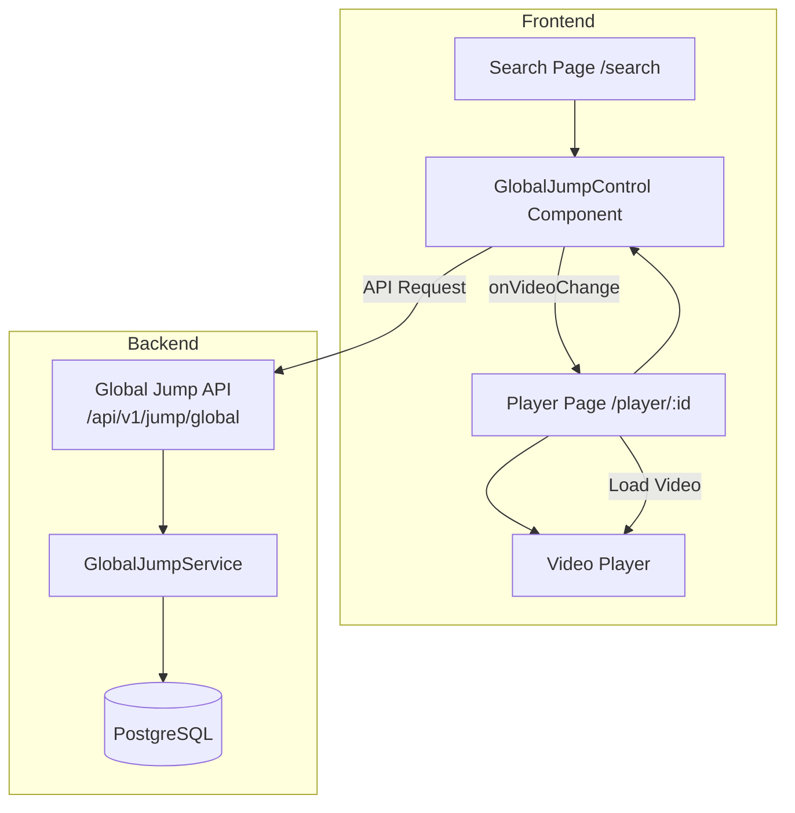
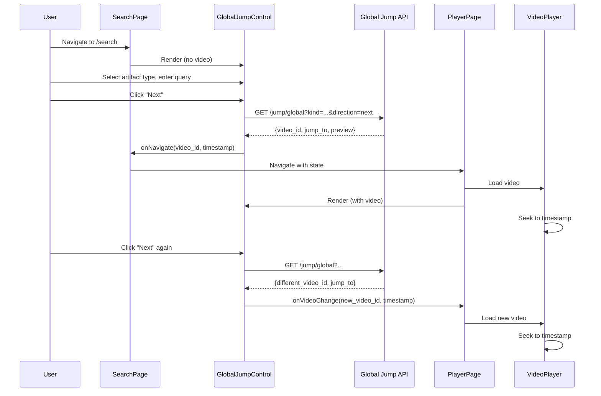
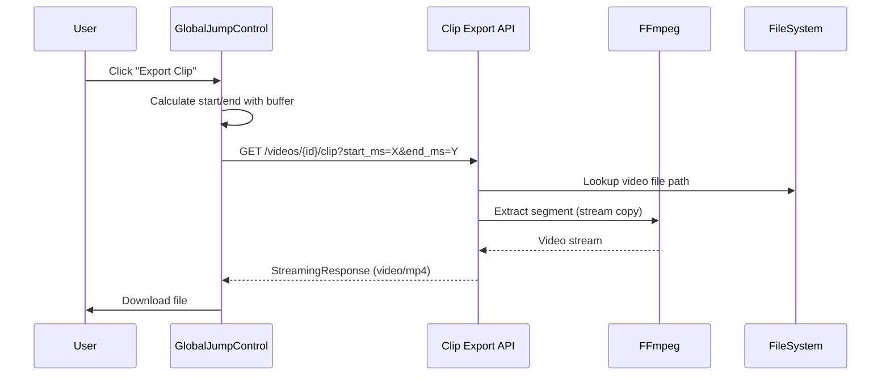

# Design Document: Global Jump Navigation GUI

## Overview

This design document describes the architecture and implementation of the Global Jump Navigation GUI feature. The feature consists of two main parts:

1. **Frontend**: A new `GlobalJumpControl` React component that replaces the existing `JumpNavigationControl`, enabling cross-video artifact search and navigation using the global jump API.

2. **Backend Enhancement**: Extending the `_search_locations_global` method in `GlobalJumpService` to support text-based queries on location fields (city, state, country).

The design follows the existing patterns in the codebase, using inline styles for React components and SQLAlchemy with raw SQL for complex queries.

## Architecture



### Component Flow



## Components and Interfaces

### Frontend Components

#### GlobalJumpControl Component

**File**: `frontend/src/components/GlobalJumpControl.tsx`

```typescript
interface GlobalJumpControlProps {
  // Current video context (optional - null when on search page)
  videoId?: string;
  videoRef?: React.RefObject<HTMLVideoElement>;
  
  // API configuration
  apiUrl?: string;
  
  // Callbacks
  onVideoChange?: (videoId: string, timestampMs: number) => Promise<void>;
  onNavigate?: (videoId: string, timestampMs: number) => void;
  
  // Initial state (for preserving form state across page navigation)
  initialArtifactType?: ArtifactType;
  initialLabel?: string;
  initialQuery?: string;
  initialConfidence?: number;
}

type ArtifactType = 'object' | 'face' | 'transcript' | 'ocr' | 'scene' | 'place' | 'location';

interface GlobalJumpResult {
  video_id: string;
  video_filename: string;
  file_created_at: string;
  jump_to: {
    start_ms: number;
    end_ms: number;
  };
  artifact_id: string;
  preview: Record<string, unknown>;
}

interface GlobalJumpResponse {
  results: GlobalJumpResult[];
  has_more: boolean;
}
```

**Handling No Video Context (Search Page Mode)**:

When `videoId` is undefined/null (search page), the component needs a starting point for the global timeline. The solution:

1. **First Search**: When user clicks "Next" with no video loaded:
   - Fetch the earliest video in the library via a lightweight API call
   - Use that video's ID as `from_video_id` with `from_ms=0`
   - Alternatively, use a special sentinel value that the backend interprets as "start of timeline"

2. **Backend Support**: The global jump API already handles this gracefully:
   - If `from_video_id` points to the earliest video and `from_ms=0`, "next" returns the first matching artifact
   - The component can fetch the first video ID on mount when in search page mode

3. **Implementation Approach**:
```typescript
// In GlobalJumpControl
const [firstVideoId, setFirstVideoId] = useState<string | null>(null);

useEffect(() => {
  // When no videoId prop, fetch the earliest video for starting point
  if (!videoId) {
    fetch(`${apiUrl}/api/v1/videos?sort=file_created_at&order=asc&limit=1`)
      .then(res => res.json())
      .then(data => {
        if (data.length > 0) {
          setFirstVideoId(data[0].video_id);
        }
      });
  }
}, [videoId, apiUrl]);

const getStartingVideoId = () => {
  // Use current video if available, otherwise use earliest video
  return videoId || firstVideoId;
};

const getCurrentTimestamp = () => {
  // Use video current time if available, otherwise start from beginning
  if (videoRef?.current) {
    return Math.floor(videoRef.current.currentTime * 1000);
  }
  return 0;
};
```

**State Management**:
- `artifactType`: Currently selected artifact type
- `label`: Label filter for object/place searches
- `query`: Text query for transcript/ocr/location searches
- `faceClusterId`: Face cluster ID for face searches
- `confidenceThreshold`: Minimum confidence (0-1)
- `loading`: Whether a request is in progress
- `currentMatch`: Display string for current result
- `lastResult`: Last navigation result (for tracking cross-video jumps)

**Key Methods**:
- `jump(direction: 'next' | 'prev')`: Execute navigation request
- `buildApiParams()`: Construct query parameters based on artifact type
- `handleResult(result: GlobalJumpResult)`: Process navigation result, trigger callbacks

#### Search Page

**File**: `frontend/src/pages/SearchPage.tsx`

```typescript
interface SearchPageState {
  artifactType: ArtifactType;
  label: string;
  query: string;
  confidence: number;
}

// Renders GlobalJumpControl without video context
// On navigation result, redirects to PlayerPage with state
```

#### Player Page Integration

**File**: `frontend/src/pages/PlayerPage.tsx` (modification)

```typescript
// Add onVideoChange handler
const handleVideoChange = async (videoId: string, timestampMs: number) => {
  // Load new video
  await loadVideo(videoId);
  // Seek to timestamp after video loads
  if (videoRef.current) {
    videoRef.current.currentTime = timestampMs / 1000;
  }
};

// Replace JumpNavigationControl with GlobalJumpControl
<GlobalJumpControl
  videoId={currentVideoId}
  videoRef={videoRef}
  onVideoChange={handleVideoChange}
  initialArtifactType={location.state?.artifactType}
  initialLabel={location.state?.label}
  initialQuery={location.state?.query}
  initialConfidence={location.state?.confidence}
/>
```

### Backend Enhancement

#### GlobalJumpService Location Text Search

**File**: `backend/src/services/global_jump_service.py`

**Method Signature Update**:
```python
def _search_locations_global(
    self,
    direction: Literal["next", "prev"],
    from_video_id: str,
    from_ms: int,
    query: str | None = None,  # NEW: text search parameter
    geo_bounds: dict | None = None,
    limit: int = 1,
) -> list[GlobalJumpResult]:
```

**SQL Enhancement**:
```sql
-- Add text search filter when query is provided
WHERE 1=1
  {direction_clause}
  {geo_filter}
  AND (
    :query IS NULL
    OR l.country ILIKE '%' || :query || '%'
    OR l.state ILIKE '%' || :query || '%'
    OR l.city ILIKE '%' || :query || '%'
  )
```

#### API Controller Update

**File**: `backend/src/api/global_jump_controller.py`

The controller already accepts the `query` parameter. The change is in routing:
- When `kind='location'` and `query` is provided, pass it to `_search_locations_global`

## Data Models

### Frontend Types

```typescript
// Artifact type configuration
const ARTIFACT_CONFIG: Record<ArtifactType, {
  label: string;
  hasLabelInput: boolean;
  hasQueryInput: boolean;
  hasConfidence: boolean;
  placeholder?: string;
}> = {
  object: {
    label: 'Objects',
    hasLabelInput: true,
    hasQueryInput: false,
    hasConfidence: true,
    placeholder: 'e.g., dog, car, person'
  },
  face: {
    label: 'Faces',
    hasLabelInput: false,
    hasQueryInput: false,
    hasConfidence: true
  },
  transcript: {
    label: 'Transcript',
    hasLabelInput: false,
    hasQueryInput: true,
    hasConfidence: false,
    placeholder: 'Search spoken words...'
  },
  ocr: {
    label: 'OCR Text',
    hasLabelInput: false,
    hasQueryInput: true,
    hasConfidence: false,
    placeholder: 'Search on-screen text...'
  },
  scene: {
    label: 'Scenes',
    hasLabelInput: false,
    hasQueryInput: false,
    hasConfidence: false
  },
  place: {
    label: 'Places',
    hasLabelInput: true,
    hasQueryInput: false,
    hasConfidence: true,
    placeholder: 'e.g., kitchen, beach, office'
  },
  location: {
    label: 'Location',
    hasLabelInput: false,
    hasQueryInput: true,
    hasConfidence: false,
    placeholder: 'e.g., Tokyo, Japan, California'
  }
};
```

### Backend Models

The existing `video_locations` table schema (no changes needed):

```sql
CREATE TABLE video_locations (
    id INTEGER PRIMARY KEY,
    video_id TEXT NOT NULL UNIQUE,
    artifact_id TEXT NOT NULL,
    latitude FLOAT NOT NULL,
    longitude FLOAT NOT NULL,
    altitude FLOAT,
    country TEXT,
    state TEXT,
    city TEXT
);

-- Existing indexes support text search
CREATE INDEX idx_video_locations_country ON video_locations(country);
CREATE INDEX idx_video_locations_state ON video_locations(state);
CREATE INDEX idx_video_locations_city ON video_locations(city);
```

### API Request/Response

**Request** (existing, no changes):
```
GET /api/v1/jump/global
  ?kind=location
  &direction=next
  &from_video_id=abc-123
  &query=Tokyo          # Now supported for location kind
```

**Response** (existing, no changes):
```json
{
  "results": [{
    "video_id": "def-456",
    "video_filename": "japan_trip.mp4",
    "file_created_at": "2025-03-15T10:30:00Z",
    "jump_to": {
      "start_ms": 0,
      "end_ms": 0
    },
    "artifact_id": "loc_001",
    "preview": {
      "latitude": 35.6762,
      "longitude": 139.6503,
      "altitude": null,
      "country": "Japan",
      "state": "Tokyo",
      "city": "Shinjuku"
    }
  }],
  "has_more": true
}
```


## Correctness Properties

*A property is a characteristic or behavior that should hold true across all valid executions of a system—essentially, a formal statement about what the system should do. Properties serve as the bridge between human-readable specifications and machine-verifiable correctness guarantees.*

### Frontend Properties

**Property 1: Global API Endpoint Usage**
*For any* search request made by GlobalJumpControl, the request URL SHALL target `/api/v1/jump/global` rather than the single-video jump endpoint.
**Validates: Requirements 1.1**

**Property 2: Cross-Video Callback Invocation**
*For any* navigation result where `result.video_id` differs from the current `videoId` prop, the `onVideoChange` callback SHALL be invoked with the new video_id and timestamp.
**Validates: Requirements 1.2, 6.2**

**Property 3: Same-Video Seek Behavior**
*For any* navigation result where `result.video_id` equals the current `videoId` prop, the component SHALL seek the video to the result timestamp WITHOUT invoking `onVideoChange`.
**Validates: Requirements 1.3**

**Property 4: Artifact Type UI Configuration**
*For any* artifact type selection, the component SHALL display the correct input fields: label input for object/place, query input for transcript/ocr/location, face cluster selector for face, and no text input for scene.
**Validates: Requirements 2.3, 2.4, 2.5, 2.6, 2.7**

**Property 5: Confidence Slider Visibility**
*For any* artifact type in {object, face, place}, the confidence slider SHALL be visible. *For any* artifact type in {transcript, ocr, scene, location}, the confidence slider SHALL be hidden.
**Validates: Requirements 3.1, 3.4**

**Property 6: Confidence Parameter Inclusion**
*For any* API request where `confidenceThreshold > 0`, the request SHALL include the `min_confidence` query parameter with the threshold value.
**Validates: Requirements 3.5**

**Property 7: Navigation Direction Parameter**
*For any* click on the Next button, the API request SHALL include `direction=next`. *For any* click on the Previous button, the API request SHALL include `direction=prev`.
**Validates: Requirements 4.2, 4.3**

**Property 8: Loading State UI**
*For any* time period while an API request is in progress, the navigation buttons SHALL be disabled AND a loading indicator SHALL be visible.
**Validates: Requirements 4.4, 4.5**

**Property 9: Form State Preservation**
*For any* navigation action (including cross-video navigation), the form state (artifactType, label, query, confidenceThreshold) SHALL remain unchanged after the navigation completes.
**Validates: Requirements 4.1.1, 4.1.2, 4.1.3, 4.1.4**

**Property 10: Match Display Content**
*For any* successful navigation result, the match display SHALL include the video filename AND the timestamp formatted as MM:SS.
**Validates: Requirements 5.1, 5.2, 5.3**

**Property 11: Cross-Video Visual Indicator**
*For any* navigation result where the video changes, a visual indicator SHALL be displayed to show cross-video navigation occurred.
**Validates: Requirements 5.4**

**Property 12: Empty Results Message**
*For any* API response with empty results array, the component SHALL display a "No results found" message.
**Validates: Requirements 5.5**

**Property 13: API Parameter Construction**
*For any* artifact type and form state combination, the API request SHALL include the correct parameters: `label` for object/place, `query` for transcript/ocr/location, `face_cluster_id` for face.
**Validates: Requirements 8.1, 8.2, 8.3, 8.4, 8.5**

### Backend Properties

**Property 14: Location Text Search**
*For any* location search with a query parameter, the search SHALL match records where the query appears (case-insensitive, partial match) in ANY of: country, state, or city fields.
**Validates: Requirements 7.1, 7.2, 7.3**

**Property 15: Location Filter Combination**
*For any* location search with both query and geo_bounds parameters, the results SHALL satisfy BOTH the text search criteria AND the geographic bounds criteria (AND logic).
**Validates: Requirements 7.4**

## Error Handling

### Frontend Error Handling

| Error Condition | Handling Strategy |
|-----------------|-------------------|
| API request fails (network error) | Display error message, keep form state, enable retry |
| API returns 400 (invalid parameters) | Display validation error from response |
| API returns 404 (video not found) | Display "Starting video not found" message |
| API returns 500 (server error) | Display generic error message, suggest retry |
| `onVideoChange` callback missing | Log warning to console, display message to user |
| `onVideoChange` callback throws | Catch error, display error message, don't update state |
| Video seek fails | Log error, display message, don't update match display |

### Backend Error Handling

| Error Condition | Handling Strategy |
|-----------------|-------------------|
| Invalid `from_video_id` | Return 404 with VIDEO_NOT_FOUND error code |
| Invalid `kind` parameter | Return 400 with INVALID_KIND error code |
| Invalid `query` for location | Return empty results (no error) |
| Database connection error | Return 500 with INTERNAL_ERROR error code |
| SQL injection attempt | Parameterized queries prevent injection |

### Error Response Format

```typescript
interface ErrorDisplay {
  message: string;
  isRetryable: boolean;
}

const ERROR_MESSAGES: Record<string, ErrorDisplay> = {
  'NETWORK_ERROR': { message: 'Network error. Please check your connection.', isRetryable: true },
  'VIDEO_NOT_FOUND': { message: 'Starting video not found.', isRetryable: false },
  'INVALID_KIND': { message: 'Invalid search type selected.', isRetryable: false },
  'INTERNAL_ERROR': { message: 'Server error. Please try again.', isRetryable: true },
};
```

## Video Clip Export (Nice to Have)

### Overview

The clip export feature allows users to download a video segment containing a search result. It uses ffmpeg on the backend to extract the clip and streams it directly to the client.

### Architecture



### Backend Endpoint

**File**: `backend/src/api/video_controller.py`

```python
@router.get("/{video_id}/clip")
async def download_clip(
    video_id: str,
    start_ms: int = Query(..., ge=0, description="Start timestamp in milliseconds"),
    end_ms: int = Query(..., ge=0, description="End timestamp in milliseconds"),
    buffer_ms: int = Query(2000, ge=0, le=10000, description="Buffer time before/after in ms"),
    session: Session = Depends(get_db),
) -> StreamingResponse:
    """
    Export a video clip between the specified timestamps.
    
    Uses ffmpeg with stream copy (-c copy) for fast extraction.
    Falls back to re-encoding if stream copy fails.
    
    Args:
        video_id: ID of the video to extract from
        start_ms: Start timestamp in milliseconds
        end_ms: End timestamp in milliseconds  
        buffer_ms: Additional buffer time before start and after end (default 2000ms)
    
    Returns:
        StreamingResponse with video/mp4 content type
    
    Raises:
        404: Video not found
        400: Invalid timestamp range (end_ms <= start_ms)
        500: FFmpeg extraction failed
    """
```

**Implementation**:

```python
import asyncio
import os
from fastapi.responses import StreamingResponse

async def download_clip(
    video_id: str,
    start_ms: int,
    end_ms: int,
    buffer_ms: int = 2000,
    session: Session = Depends(get_db),
) -> StreamingResponse:
    # Validate video exists and get file path
    video = session.query(Video).filter(Video.video_id == video_id).first()
    if not video:
        raise HTTPException(status_code=404, detail="Video not found")
    
    # Validate timestamp range
    if end_ms <= start_ms:
        raise HTTPException(status_code=400, detail="end_ms must be greater than start_ms")
    
    # Apply buffer (clamp to valid range)
    actual_start_ms = max(0, start_ms - buffer_ms)
    actual_end_ms = end_ms + buffer_ms
    
    # Convert to seconds for ffmpeg
    start_sec = actual_start_ms / 1000
    duration_sec = (actual_end_ms - actual_start_ms) / 1000
    
    # Build ffmpeg command
    # -ss before -i for fast seeking
    # -c copy for stream copy (fast, keyframe-aligned)
    # -movflags frag_keyframe+empty_moov for streaming output
    cmd = [
        "ffmpeg",
        "-ss", str(start_sec),
        "-i", video.filepath,
        "-t", str(duration_sec),
        "-c", "copy",
        "-movflags", "frag_keyframe+empty_moov",
        "-f", "mp4",
        "pipe:1"
    ]
    
    # Create subprocess
    process = await asyncio.create_subprocess_exec(
        *cmd,
        stdout=asyncio.subprocess.PIPE,
        stderr=asyncio.subprocess.PIPE,
    )
    
    # Generate filename
    start_fmt = f"{int(start_sec // 60)}m{int(start_sec % 60)}s"
    end_fmt = f"{int((actual_end_ms/1000) // 60)}m{int((actual_end_ms/1000) % 60)}s"
    base_name = os.path.splitext(video.filename)[0]
    clip_filename = f"{base_name}_{start_fmt}-{end_fmt}.mp4"
    
    async def stream_output():
        while True:
            chunk = await process.stdout.read(65536)  # 64KB chunks
            if not chunk:
                break
            yield chunk
        
        # Wait for process to complete
        await process.wait()
        if process.returncode != 0:
            stderr = await process.stderr.read()
            logger.error(f"FFmpeg failed: {stderr.decode()}")
    
    return StreamingResponse(
        stream_output(),
        media_type="video/mp4",
        headers={
            "Content-Disposition": f'attachment; filename="{clip_filename}"'
        }
    )
```

### Frontend Component Update

**File**: `frontend/src/components/GlobalJumpControl.tsx`

Add export clip button and handler:

```typescript
interface GlobalJumpControlProps {
  // ... existing props
}

// Add to component state
const [exporting, setExporting] = useState(false);

// Add export handler
const exportClip = async () => {
  if (!lastResult || !videoId) return;
  
  setExporting(true);
  try {
    const { start_ms, end_ms } = lastResult.jump_to;
    const buffer_ms = 2000; // 2 second buffer
    
    const params = new URLSearchParams({
      start_ms: start_ms.toString(),
      end_ms: end_ms.toString(),
      buffer_ms: buffer_ms.toString(),
    });
    
    const response = await fetch(
      `${apiUrl}/api/v1/videos/${videoId}/clip?${params}`
    );
    
    if (!response.ok) {
      throw new Error('Failed to export clip');
    }
    
    // Get filename from Content-Disposition header
    const disposition = response.headers.get('Content-Disposition');
    const filenameMatch = disposition?.match(/filename="(.+)"/);
    const filename = filenameMatch?.[1] || 'clip.mp4';
    
    // Download the blob
    const blob = await response.blob();
    const url = URL.createObjectURL(blob);
    const a = document.createElement('a');
    a.href = url;
    a.download = filename;
    document.body.appendChild(a);
    a.click();
    document.body.removeChild(a);
    URL.revokeObjectURL(url);
  } catch (err) {
    console.error('Export failed:', err);
    setCurrentMatch('Export failed');
  } finally {
    setExporting(false);
  }
};

// Add to JSX (in navigation buttons section)
{lastResult && (
  <button
    onClick={exportClip}
    disabled={exporting || loading}
    style={{
      padding: '8px 16px',
      backgroundColor: '#2a5a2a',
      color: '#fff',
      border: '1px solid #3a7a3a',
      borderRadius: '4px',
      fontSize: '12px',
      cursor: exporting ? 'not-allowed' : 'pointer',
      opacity: exporting ? 0.5 : 1,
    }}
  >
    {exporting ? 'Exporting...' : '📥 Export Clip'}
  </button>
)}
```

### UI Layout

```
┌─────────────────────────────────────────────────────────────────┐
│ Jump to: [Object ▼]                                             │
├─────────────────────────────────────────────────────────────────┤
│ Label: [dog, car, person...                    ]                │
├─────────────────────────────────────────────────────────────────┤
│ Confidence: [═══════●═══] 70%                                   │
├─────────────────────────────────────────────────────────────────┤
│ [← Previous] [Next →] [📥 Export Clip]    dog @ 1:23 (video.mp4)│
└─────────────────────────────────────────────────────────────────┘
```

### Error Handling

| Error Condition | Handling Strategy |
|-----------------|-------------------|
| Video file not found on disk | Return 404 with descriptive message |
| FFmpeg not installed | Return 500, log error for admin |
| FFmpeg extraction fails | Return 500, include stderr in logs |
| Invalid timestamp range | Return 400 with validation message |
| Timestamp beyond video duration | FFmpeg handles gracefully (extracts to end) |
| Network interruption during download | Browser handles partial download |

### Correctness Properties

**Property 16: Clip Export Timestamp Accuracy**
*For any* clip export request with `start_ms` and `end_ms`, the exported clip SHALL begin within 1 second of `start_ms - buffer_ms` (due to keyframe alignment with stream copy).
**Validates: Requirements 11.3**

**Property 17: Clip Export Streaming**
*For any* clip export request, the response SHALL be streamed directly to the client without buffering the entire file in memory.
**Validates: Requirements 11.6**

**Property 18: Export Button Visibility**
*For any* state where `lastResult` is non-null, the Export Clip button SHALL be visible. *For any* state where `lastResult` is null, the Export Clip button SHALL be hidden.
**Validates: Requirements 11.1**

## Testing Strategy

### Unit Tests

Unit tests verify specific examples and edge cases:

**Frontend Unit Tests**:
- Component renders without video context (search page mode)
- Component renders with video context (player page mode)
- Artifact type dropdown contains all 7 options
- Confidence slider has correct min/max/step values
- Timestamp formatting (0ms → "0:00", 65000ms → "1:05", 3661000ms → "61:01")
- Error message display for various error codes

**Backend Unit Tests**:
- Location search with empty query returns all locations
- Location search with query matching country returns correct results
- Location search with query matching state returns correct results
- Location search with query matching city returns correct results
- Location search with non-matching query returns empty results
- Location search with geo_bounds only (existing behavior preserved)

### Property-Based Tests

Property-based tests verify universal properties across many generated inputs. Each test runs minimum 100 iterations.

**Frontend Property Tests** (using fast-check):

1. **API Endpoint Property Test**
   - Generate random artifact types and form states
   - Verify all requests target `/api/v1/jump/global`
   - **Feature: global-jump-navigation-gui, Property 1: Global API Endpoint Usage**

2. **Cross-Video Callback Property Test**
   - Generate random current video IDs and result video IDs
   - When IDs differ, verify `onVideoChange` is called
   - **Feature: global-jump-navigation-gui, Property 2: Cross-Video Callback Invocation**

3. **Artifact Type UI Property Test**
   - Generate all artifact types
   - Verify correct input fields are shown for each type
   - **Feature: global-jump-navigation-gui, Property 4: Artifact Type UI Configuration**

4. **Confidence Slider Visibility Property Test**
   - Generate all artifact types
   - Verify slider visibility matches expected configuration
   - **Feature: global-jump-navigation-gui, Property 5: Confidence Slider Visibility**

5. **API Parameter Construction Property Test**
   - Generate random artifact types, labels, queries, confidence values
   - Verify API requests include correct parameters for each type
   - **Feature: global-jump-navigation-gui, Property 13: API Parameter Construction**

**Backend Property Tests** (using Hypothesis):

6. **Location Text Search Property Test**
   - Generate random location records with country/state/city values
   - Generate random query strings
   - Verify matches are found when query appears in any field (case-insensitive)
   - **Feature: global-jump-navigation-gui, Property 14: Location Text Search**

7. **Location Filter Combination Property Test**
   - Generate random location records with coordinates and names
   - Generate random queries and geo_bounds
   - Verify results satisfy both criteria when both provided
   - **Feature: global-jump-navigation-gui, Property 15: Location Filter Combination**

### Integration Tests

- End-to-end flow: Search page → API → Player page navigation
- Cross-video navigation with actual video loading
- Form state preservation through page transitions
- Error handling with mocked API failures

### Test Configuration

**Frontend (Jest + React Testing Library + fast-check)**:
```typescript
import fc from 'fast-check';

// Property test configuration
const PBT_CONFIG = {
  numRuns: 100,
  verbose: true,
};
```

**Backend (pytest + Hypothesis)**:
```python
from hypothesis import given, settings, strategies as st

# Property test configuration
@settings(max_examples=100)
```
