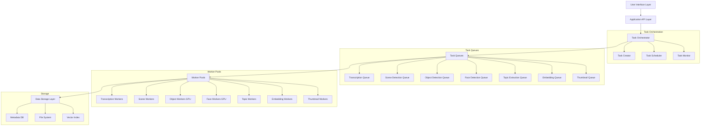
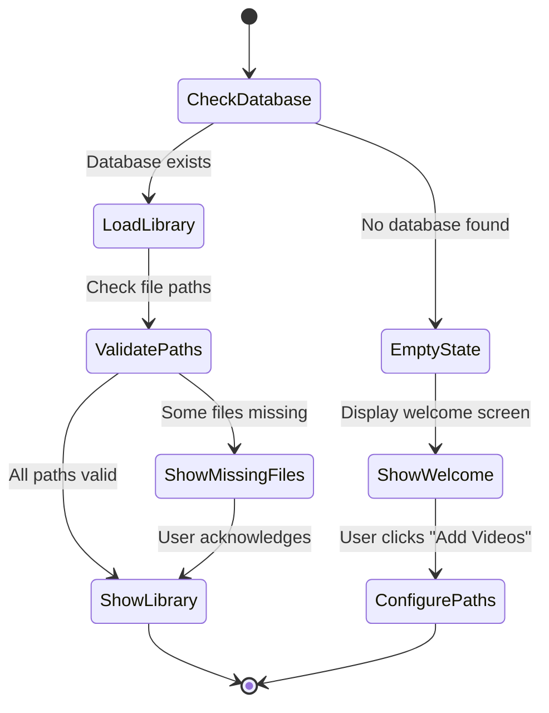
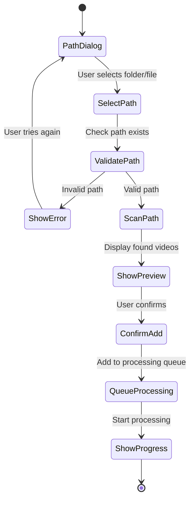
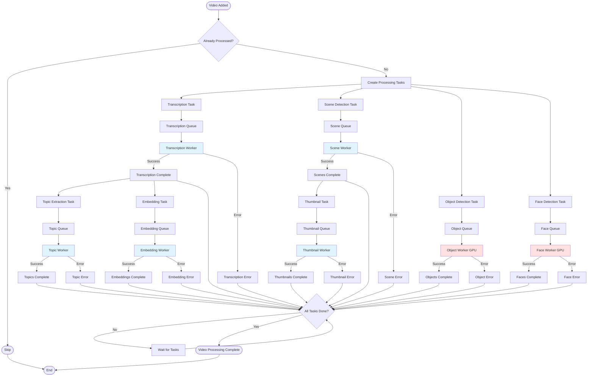
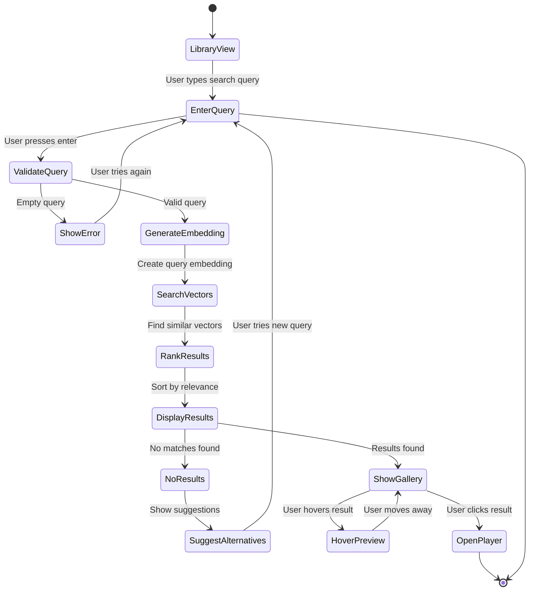
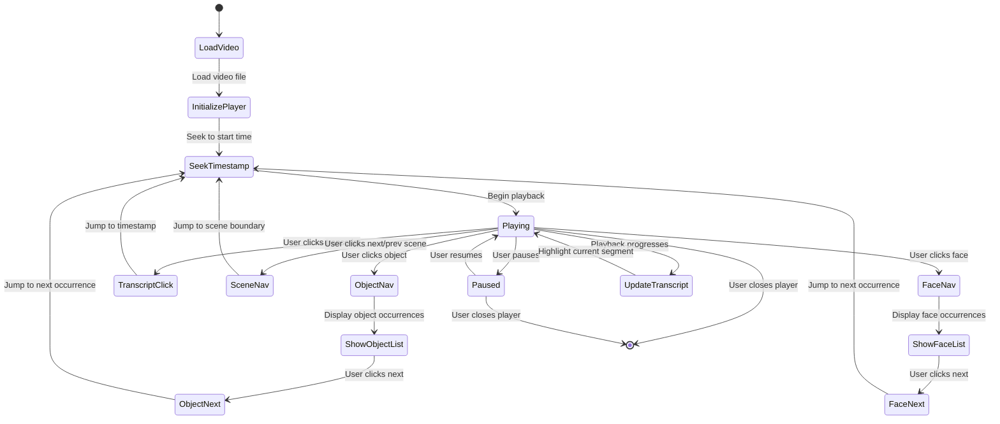
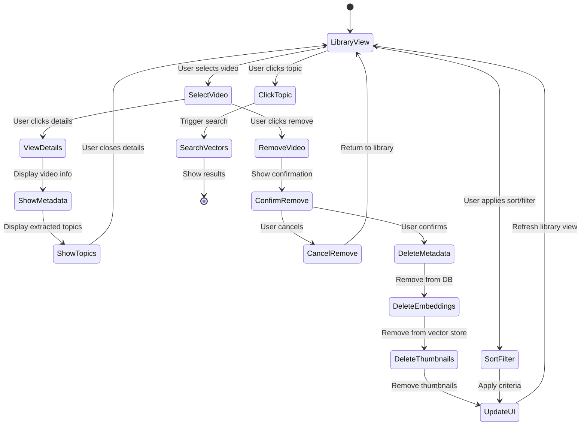
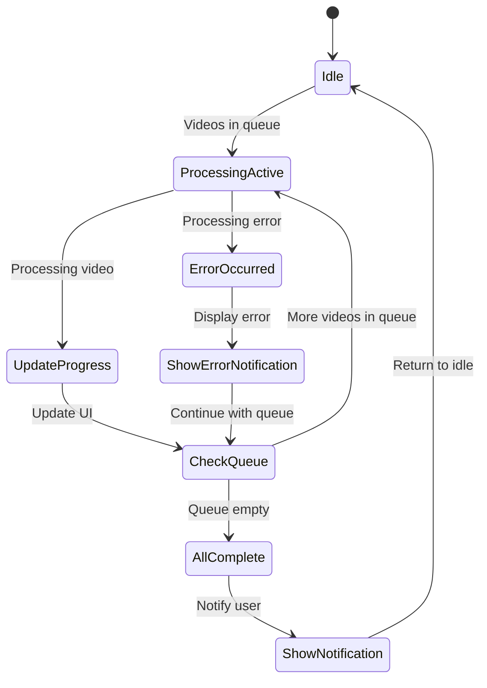

# Design Document: Semantic Video Search Platform (Eioku)

## Overview

Eioku is a semantic video search platform designed to help video editors quickly find specific content within large video libraries. The system processes videos from configured file paths, extracts audio for transcription, performs computer vision analysis (scene detection, object detection, face detection), and enables semantic search through natural language queries. The platform provides an interactive player view with multiple navigation methods including transcript-based navigation, scene jumping, and object/face-based navigation.

The architecture follows a modular design with clear separation between video processing, search indexing, and user interface components. This enables independent scaling and future extensibility (such as Adobe Premiere plugin integration).

## Technology Stack

### Core Application

**Backend Framework**: Python 3.10+
- **Rationale**: Excellent ML/AI library ecosystem, matches existing video processing scripts
- **Web Framework**: FastAPI for REST API endpoints
- **Task Queue**: Celery with Redis backend for distributed task processing
- **Process Management**: Multiprocessing for CPU-bound tasks, asyncio for I/O

**Frontend Framework**: Electron + React + TypeScript
- **Rationale**: Cross-platform desktop application with native feel
- **UI Library**: Tailwind CSS for component library
- **State Management**: Zustand
- **Video Player**: Video.js or custom HTML5 video player

**Alternative Frontend**: Tauri + React + TypeScript
- **Rationale**: Lighter weight than Electron, better performance, Rust-based
- **Consideration**: Newer ecosystem, may have fewer resources

### Data Storage

**Primary Database**: SQLite
- **Rationale**: Serverless, portable, sufficient for local desktop application
- **Schema**: Video metadata, transcriptions, scenes, objects, faces, topics, paths

**Vector Database**: FAISS (Facebook AI Similarity Search)
- **Rationale**: File-based (no server), fast vector similarity search, scales to 100K+ vectors
- **Storage**: Single .index file per library
- **Search**: Optimized cosine similarity and approximate nearest neighbor
- **Zero-Ops**: Just a file, no server process required
- **Library**: faiss-cpu or faiss-gpu (GPU acceleration optional)

**File Storage**: Local file system
- **Thumbnails**: Generated scene thumbnails
- **Cache**: Temporary processing files
- **References**: Video file paths (no file copying)

### Machine Learning & AI

**Transcription**: OpenAI Whisper
- **Model**: whisper-large-v3 or whisper-large-v3-turbo
- **Library**: openai-whisper or faster-whisper (optimized)
- **GPU Acceleration**: CUDA support for faster processing

**Semantic Embeddings**: sentence-transformers
- **Model**: all-MiniLM-L6-v2 (384 dimensions, fast)
- **Alternative**: nomic-embed-text (better quality, slower)
- **Library**: sentence-transformers

**Scene Detection**: PySceneDetect
- **Detector**: ContentDetector (detects scene changes)
- **Backend**: OpenCV for video processing

**Object Detection**: Ultralytics YOLOv8
- **Model**: yolov8n.pt (nano, fast) or yolov8s.pt (small, more accurate)
- **Library**: ultralytics
- **GPU Acceleration**: CUDA support

**Face Detection**: Ultralytics YOLOv8 Face
- **Model**: yolov8n-face.pt
- **Library**: ultralytics
- **Face Clustering**: scikit-learn (DBSCAN or HDBSCAN)
- **Face Embeddings**: FaceNet or ArcFace (optional)

**Topic Extraction**: 
- **Option 1**: KeyBERT (keyword extraction from embeddings)
- **Option 2**: BERTopic (topic modeling)
- **Option 3**: LLM-based (OpenAI API or local LLM)

**Action Detection** (Optional):
- **Models**: X3D, SlowFast, or TimeSformer
- **Library**: pytorchvideo or transformers
- **Dataset**: Kinetics-400 labels

### Video Processing

**Video I/O**: FFmpeg
- **Library**: ffmpeg-python or subprocess calls
- **Operations**: Audio extraction, thumbnail generation, frame extraction
- **Formats**: MP4, MOV, AVI, MKV support

**Computer Vision**: OpenCV (cv2)
- **Operations**: Frame reading, image processing
- **Integration**: Used by PySceneDetect and YOLO

### Task Processing

**Task Queue**: Python multiprocessing + threading
- **Rationale**: Zero external dependencies, built into Python, perfect for single-host
- **Implementation**: multiprocessing.Pool for CPU tasks, ThreadPoolExecutor for I/O
- **Worker Management**: Process pools per task type
- **Queue**: multiprocessing.Queue or queue.Queue
- **Monitoring**: Simple progress tracking in SQLite

**Alternative**: Celery + Redis
- **Rationale**: More features, distributed capable, web monitoring
- **Consideration**: Requires Redis server, more complex setup, overkill for single-host
- **Recommendation**: Only if you need distributed processing later

**Decision**: Use Python multiprocessing for zero-ops deployment

### Development & Testing

**Testing Framework**: pytest
- **Property-Based Testing**: Hypothesis
- **Coverage**: pytest-cov
- **Mocking**: pytest-mock

**Code Quality**:
- **Linting**: ruff or pylint
- **Formatting**: black
- **Type Checking**: mypy

**Build & Package**:
- **Python**: poetry or pip-tools for dependency management
- **Electron**: electron-builder for packaging
- **Tauri**: tauri-cli for packaging

### Deployment

**Distribution**:
- **Windows**: .exe installer (electron-builder or tauri)
- **macOS**: .dmg or .app bundle
- **Linux**: .AppImage, .deb, or .rpm

**Updates**:
- **Electron**: electron-updater for auto-updates
- **Tauri**: Built-in updater

### Hardware Requirements

**Minimum**:
- CPU: 4 cores
- RAM: 8 GB
- GPU: Optional (CPU fallback available)
- Storage: 10 GB + video library size

**Recommended**:
- CPU: 8+ cores
- RAM: 16 GB
- GPU: NVIDIA GPU with 4+ GB VRAM (CUDA support)
- Storage: SSD with 50 GB + video library size

### Technology Decision Summary

| Component | Technology | Alternative | Decision Rationale |
|-----------|-----------|-------------|-------------------|
| Backend Language | Python 3.10+ | Node.js | ML/AI ecosystem, existing scripts |
| Frontend Framework | Electron + React | Tauri + React | Mature ecosystem, more resources |
| Database | SQLite | PostgreSQL | Serverless, portable, zero-ops |
| Vector Store | FAISS | ChromaDB | File-based, fast, zero-ops, scales well |
| Task Queue | multiprocessing | Celery + Redis | Zero-ops, built-in, single-host |
| Transcription | Whisper Large V3 | AssemblyAI | Local, no API costs, accurate |
| Embeddings | all-MiniLM-L6-v2 | nomic-embed-text | Fast, good quality, small |
| Object Detection | YOLOv8 | YOLO26 | Proven, stable, good docs |
| Face Detection | YOLOv8 Face | RetinaFace | Consistent with object detection |
| Scene Detection | PySceneDetect | Custom | Mature, reliable, easy to use |

## Architecture

### High-Level Architecture



### Component Layers

1. **User Interface Layer**: Desktop application providing library management, search interface, result gallery, and interactive player view
2. **Application API Layer**: Business logic coordinating video processing, search operations, and data retrieval
3. **Video Processing Pipeline**: Parallel task-based processing with independent worker pools for each processing type
4. **Search & Index Layer**: Semantic search using vector embeddings and similarity matching
5. **Data Storage Layer**: Persistent storage for metadata, vector indices, and file references

## Processing Profiles

The system uses configurable processing profiles to control resource allocation and task prioritization. Users can select from predefined profiles or create custom configurations.

### Default Profile: "Balanced"

**Purpose**: Optimized for general use with balanced resource allocation

**Worker Configuration**:
```json
{
  "profile": "balanced",
  "workers": {
    "transcription": {
      "count": 2,
      "priority": "high",
      "resource": "cpu"
    },
    "scene_detection": {
      "count": 2,
      "priority": "medium",
      "resource": "cpu"
    },
    "object_detection": {
      "count": 2,
      "priority": "medium",
      "resource": "gpu"
    },
    "face_detection": {
      "count": 2,
      "priority": "medium",
      "resource": "gpu"
    },
    "topic_extraction": {
      "count": 1,
      "priority": "low",
      "resource": "cpu"
    },
    "embedding_generation": {
      "count": 1,
      "priority": "high",
      "resource": "cpu"
    },
    "thumbnail_generation": {
      "count": 1,
      "priority": "low",
      "resource": "cpu"
    }
  },
  "task_settings": {
    "max_concurrent_videos": 5,
    "frame_sampling_interval": 30,
    "face_sampling_interval_seconds": 5.0
  }
}
```

**Rationale**:
- **Transcription (High Priority, 2 workers)**: Critical for search functionality, gets priority
- **Embedding Generation (High Priority, 1 worker)**: Required for search, processes after transcription
- **Scene Detection (Medium Priority, 2 workers)**: Important for navigation, runs in parallel
- **Object Detection (Medium Priority, 2 workers)**: GPU-bound, runs in parallel with faces
- **Face Detection (Medium Priority, 2 workers)**: GPU-bound, shares GPU with objects
- **Topic Extraction (Low Priority, 1 worker)**: Nice-to-have, processes after transcription
- **Thumbnail Generation (Low Priority, 1 worker)**: Visual enhancement, processes after scenes

### Alternative Profile: "Search First"

**Purpose**: Prioritize getting videos searchable quickly

**Worker Configuration**:
```json
{
  "profile": "search_first",
  "workers": {
    "transcription": {
      "count": 4,
      "priority": "critical",
      "resource": "cpu"
    },
    "embedding_generation": {
      "count": 2,
      "priority": "critical",
      "resource": "cpu"
    },
    "scene_detection": {
      "count": 1,
      "priority": "low",
      "resource": "cpu"
    },
    "object_detection": {
      "count": 1,
      "priority": "low",
      "resource": "gpu"
    },
    "face_detection": {
      "count": 1,
      "priority": "low",
      "resource": "gpu"
    },
    "topic_extraction": {
      "count": 1,
      "priority": "medium",
      "resource": "cpu"
    },
    "thumbnail_generation": {
      "count": 1,
      "priority": "low",
      "resource": "cpu"
    }
  },
  "task_settings": {
    "max_concurrent_videos": 10,
    "frame_sampling_interval": 60,
    "face_sampling_interval_seconds": 10.0
  }
}
```

**Use Case**: When you need to search videos immediately, visual features can wait

### Alternative Profile: "Visual First"

**Purpose**: Prioritize object and face detection for visual navigation

**Worker Configuration**:
```json
{
  "profile": "visual_first",
  "workers": {
    "transcription": {
      "count": 1,
      "priority": "medium",
      "resource": "cpu"
    },
    "embedding_generation": {
      "count": 1,
      "priority": "medium",
      "resource": "cpu"
    },
    "scene_detection": {
      "count": 2,
      "priority": "high",
      "resource": "cpu"
    },
    "object_detection": {
      "count": 3,
      "priority": "critical",
      "resource": "gpu"
    },
    "face_detection": {
      "count": 3,
      "priority": "critical",
      "resource": "gpu"
    },
    "topic_extraction": {
      "count": 1,
      "priority": "low",
      "resource": "cpu"
    },
    "thumbnail_generation": {
      "count": 2,
      "priority": "high",
      "resource": "cpu"
    }
  },
  "task_settings": {
    "max_concurrent_videos": 3,
    "frame_sampling_interval": 15,
    "face_sampling_interval_seconds": 2.0
  }
}
```

**Use Case**: When visual navigation (objects, faces, scenes) is more important than search

### Alternative Profile: "Low Resource"

**Purpose**: Minimal resource usage for background processing

**Worker Configuration**:
```json
{
  "profile": "low_resource",
  "workers": {
    "transcription": {
      "count": 1,
      "priority": "high",
      "resource": "cpu"
    },
    "embedding_generation": {
      "count": 1,
      "priority": "high",
      "resource": "cpu"
    },
    "scene_detection": {
      "count": 1,
      "priority": "medium",
      "resource": "cpu"
    },
    "object_detection": {
      "count": 1,
      "priority": "medium",
      "resource": "gpu"
    },
    "face_detection": {
      "count": 1,
      "priority": "medium",
      "resource": "gpu"
    },
    "topic_extraction": {
      "count": 1,
      "priority": "low",
      "resource": "cpu"
    },
    "thumbnail_generation": {
      "count": 1,
      "priority": "low",
      "resource": "cpu"
    }
  },
  "task_settings": {
    "max_concurrent_videos": 1,
    "frame_sampling_interval": 60,
    "face_sampling_interval_seconds": 10.0
  }
}
```

**Use Case**: When running on limited hardware or processing in background

### Profile Configuration Interface

**User Controls**:
- Select predefined profile from dropdown
- Adjust worker counts per task type
- Set priority levels (critical, high, medium, low)
- Configure sampling intervals
- Set max concurrent videos
- Save custom profiles

**Dynamic Adjustment**:
- System monitors resource usage (CPU, GPU, memory)
- Automatically throttles workers if resources are constrained
- Warns user if configuration exceeds available resources
- Suggests profile adjustments based on hardware capabilities

## User Flows

### Flow 1: Initial Application Launch



**States:**
- **CheckDatabase**: Application checks for existing SQLite database
- **EmptyState**: No videos configured, show welcome/onboarding
- **LoadLibrary**: Load existing library metadata and indices
- **ValidatePaths**: Verify all video file paths still exist
- **ShowLibrary**: Display library view with all videos
- **ShowMissingFiles**: Alert user to missing/moved files
- **ConfigurePaths**: Show path configuration dialog

### Flow 2: Adding Videos (Path Configuration)



**States:**
- **PathDialog**: User interface for adding folder or file paths
- **SelectPath**: User browses and selects path
- **ValidatePath**: Verify path exists and is accessible
- **ShowError**: Display error message for invalid paths
- **ScanPath**: Discover all video files in path
- **ShowPreview**: Show list of videos that will be added
- **ConfirmAdd**: User confirms addition
- **QueueProcessing**: Add videos to processing queue
- **ShowProgress**: Navigate to processing status view

### Flow 3: Video Processing Pipeline (Parallel Architecture)



**Key Parallel Processing Characteristics:**

**Independent Tasks (Run in Parallel)**:
- Transcription Task (CPU-bound, blue)
- Scene Detection Task (CPU-bound, blue)
- Object Detection Task (GPU-bound, red)
- Face Detection Task (GPU-bound, red)

These four tasks start simultaneously and run in parallel. They do NOT wait for each other.

**Dependent Tasks (Run After Parent Completes)**:
- Topic Extraction Task → depends on Transcription
- Embedding Generation Task → depends on Transcription
- Thumbnail Generation Task → depends on Scene Detection

**Example Timeline**:
```
Time 0s:  Video added
Time 1s:  All 4 independent tasks start simultaneously
          - Transcription Worker 1 starts
          - Scene Worker 1 starts
          - Object Worker 1 starts (GPU)
          - Face Worker 1 starts (GPU)

Time 30s: Scene detection completes first
          - Thumbnail task created and starts

Time 45s: Transcription completes
          - Topic extraction task created and starts
          - Embedding generation task created and starts

Time 60s: Object detection completes
Time 75s: Face detection completes
Time 80s: Topic extraction completes
Time 85s: Embedding generation completes
Time 90s: Thumbnail generation completes

Time 90s: All tasks complete → Video marked as "Completed"
```

**Multi-Video Parallelism**:
With default "Balanced" profile (2 workers per type):
- Video A: Transcription Worker 1, Scene Worker 1, Object Worker 1, Face Worker 1
- Video B: Transcription Worker 2, Scene Worker 2, Object Worker 2, Face Worker 2
- Video C: Waits in queue for available workers
- Video D: Waits in queue for available workers
- Video E: Waits in queue for available workers

**Status Tracking**:
Each video shows granular progress:
```
Video: example.mp4
├─ Transcription: ✓ Complete (45s)
├─ Scene Detection: ✓ Complete (30s)
├─ Object Detection: ✓ Complete (60s)
├─ Face Detection: ✓ Complete (75s)
├─ Topic Extraction: ✓ Complete (80s)
├─ Embedding Generation: ✓ Complete (85s)
└─ Thumbnail Generation: ✓ Complete (90s)

Overall: 100% Complete (90s total)
```

### Flow 4: Search Interaction



**States:**
- **LibraryView**: Main library view with search bar
- **EnterQuery**: User typing search query
- **ValidateQuery**: Check query is not empty
- **ShowError**: Display error for invalid query
- **GenerateEmbedding**: Convert query to vector embedding
- **SearchVectors**: Search vector database for similar embeddings
- **RankResults**: Sort results by relevance score
- **DisplayResults**: Determine if results exist
- **NoResults**: No matching results found
- **SuggestAlternatives**: Show alternative search terms
- **ShowGallery**: Display result gallery
- **HoverPreview**: Show video preview on hover
- **OpenPlayer**: Open player view at matched timestamp

### Flow 5: Player View Navigation



**States:**
- **LoadVideo**: Load video file from path
- **InitializePlayer**: Set up video player
- **SeekTimestamp**: Seek to specific timestamp
- **Playing**: Video is playing
- **Paused**: Video is paused
- **TranscriptClick**: User clicked transcript text
- **SceneNav**: User clicked scene navigation
- **ObjectNav**: User clicked object from list
- **ShowObjectList**: Display all object occurrences
- **ObjectNext**: Navigate to next object occurrence
- **FaceNav**: User clicked face from list
- **ShowFaceList**: Display all face occurrences
- **FaceNext**: Navigate to next face occurrence
- **UpdateTranscript**: Update transcript highlight

**Navigation Methods:**
1. **Transcript Navigation**: Click any transcript text to jump to that timestamp
2. **Scene Navigation**: Next/Previous buttons to jump between scene boundaries
3. **Object Navigation**: Select object, navigate through all occurrences
4. **Face Navigation**: Select face, navigate through all occurrences
5. **Timeline Scrubbing**: Standard video player timeline

### Flow 6: Library Management



**States:**
- **LibraryView**: Main library view
- **SelectVideo**: User selects a video
- **ViewDetails**: Show detailed video information
- **ShowMetadata**: Display video metadata
- **ShowTopics**: Display extracted topics
- **RemoveVideo**: User initiates removal
- **ConfirmRemove**: Confirmation dialog
- **CancelRemove**: User cancels removal
- **DeleteMetadata**: Remove from database
- **DeleteEmbeddings**: Remove from vector store
- **DeleteThumbnails**: Remove thumbnail files
- **UpdateUI**: Refresh user interface
- **SortFilter**: Apply sorting/filtering
- **ClickTopic**: User clicks suggested topic

### Flow 7: Background Processing Status



**States:**
- **Idle**: No videos being processed
- **ProcessingActive**: Videos currently processing
- **UpdateProgress**: Update progress indicators
- **CheckQueue**: Check if more videos to process
- **AllComplete**: All videos processed
- **ShowNotification**: Notify user of completion
- **ErrorOccurred**: Processing error
- **ShowErrorNotification**: Display error notification

**UI Indicators:**
- Progress bar for each video
- Overall queue progress
- Current processing stage
- Estimated time remaining
- Error indicators with details

## Components and Interfaces

### 1. Video Processing Pipeline

**Purpose**: Process videos from configured paths and extract searchable content using parallel task-based architecture

**Sub-components**:

#### 1.0 Task Orchestrator
- **Responsibility**: Coordinate parallel video processing tasks
- **Interface**:
  ```
  createVideoTasks(videoId: string) -> Task[]
  scheduleTask(task: Task) -> boolean
  monitorTasks(videoId: string) -> TaskStatus[]
  cancelTasks(videoId: string) -> boolean
  getQueueStatus() -> QueueStatus
  ```
- **Task Types**:
  ```
  Task {
    taskId: string
    videoId: string
    taskType: enum (transcription, scene, object, face, topic, embedding, thumbnail)
    status: enum (queued, running, completed, error)
    priority: enum (critical, high, medium, low)
    dependencies: string[]  // taskIds that must complete first
    createdAt: timestamp
    startedAt: timestamp?
    completedAt: timestamp?
    error: string?
  }
  ```
- **Orchestration Logic**:
  - Creates independent tasks for each video
  - Manages task dependencies (e.g., topic extraction depends on transcription)
  - Distributes tasks to appropriate queues based on type
  - Monitors task completion and triggers dependent tasks
  - Tracks overall video processing status

#### 1.1 Path Manager
- **Responsibility**: Manage configured folder and file paths
- **Interface**:
  ```
  addPath(path: string, recursive: boolean) -> PathConfig
  removePath(pathId: string) -> boolean
  listPaths() -> PathConfig[]
  scanPath(pathId: string) -> VideoFile[]
  detectChanges() -> VideoFile[]
  ```

#### 1.2 Video Ingestion Controller
- **Responsibility**: Coordinate video discovery and processing
- **Interface**:
  ```
  discoverVideos(pathConfig: PathConfig) -> VideoFile[]
  queueForProcessing(videos: VideoFile[]) -> ProcessingJob[]
  checkDuplicates(video: VideoFile) -> boolean
  monitorProgress(jobId: string) -> ProcessingStatus
  ```

#### 1.3 Transcription Engine
- **Responsibility**: Convert audio to text with timestamps
- **Technology**: OpenAI Whisper (recommend Whisper Large V3 or Turbo for balance of accuracy and speed)
- **Interface**:
  ```
  transcribe(audioPath: string, language: string) -> Transcription
  ```
- **Output Format**:
  ```
  Transcription {
    segments: TranscriptSegment[]
    language: string
    confidence: float
  }
  
  TranscriptSegment {
    text: string
    start: float  // start time in seconds
    end: float    // end time in seconds
    confidence: float
    speaker: string?  // optional speaker ID
  }
  ```
- **GPU Acceleration**: Utilize CUDA/GPU when available for faster processing

#### 1.4 Scene Detector
- **Responsibility**: Identify scene boundaries in videos
- **Technology**: PySceneDetect with ContentDetector
- **Interface**:
  ```
  detectScenes(videoPath: string) -> SceneBoundary[]
  ```
- **Output Format**:
  ```
  SceneBoundary {
    scene: int  // scene number
    start: string  // timecode format (HH:MM:SS.mmm)
    end: string    // timecode format (HH:MM:SS.mmm)
  }
  ```

#### 1.5 Object Detector
- **Responsibility**: Detect and track objects in video frames
- **Technology**: YOLOv8 (ultralytics)
- **Interface**:
  ```
  detectObjects(videoPath: string, frameInterval: int) -> ObjectDetection[]
  ```
- **Output Format**:
  ```
  ObjectDetection {
    frame: int
    labels: string[]  // unique labels in this frame
    objects: DetectedObject[]
  }
  
  DetectedObject {
    label: string
    bbox: [x1, y1, x2, y2]  // xyxy format
    confidence: float
  }
  ```

#### 1.6 Face Detector
- **Responsibility**: Detect and track faces in video frames
- **Technology**: YOLOv8 face model (yolov8n-face.pt) with SQLite storage
- **Interface**:
  ```
  detectFaces(videoPath: string, intervalSeconds: float) -> FaceDetection[]
  ```
- **Output Format**:
  ```
  FaceDetection {
    frame: int
    bbox: [x1, y1, x2, y2]  // xyxy format
    confidence: float
    embedding: bytes?  // optional face embedding for clustering
  }
  ```

#### 1.7 Topic Extractor
- **Responsibility**: Extract key topics and themes from transcriptions
- **Technology**: Sentence embeddings + clustering or LLM-based extraction
- **Interface**:
  ```
  extractTopics(transcription: Transcription) -> Topic[]
  aggregateTopics(topics: Topic[]) -> TopicSummary[]
  ```
- **Output Format**:
  ```
  Topic {
    topicId: string
    label: string
    keywords: string[]
    relevanceScore: float
    timestamps: float[]
  }
  
  TopicSummary {
    label: string
    frequency: int
    videoIds: string[]
  }
  ```

#### 1.8 Action Detector (Optional Enhancement)
- **Responsibility**: Detect actions and activities in video content
- **Technology**: X3D, SlowFast, or TimeSformer models trained on Kinetics-400
- **Interface**:
  ```
  detectActions(videoPath: string, stride: int, window: int) -> ActionDetection[]
  ```
- **Output Format**:
  ```
  ActionDetection {
    frame: int
    timestamp: float
    labels: string[]  // top-5 action labels
    scores: float[]   // confidence scores for each label
  }
  ```
- **Note**: This is an optional enhancement that can provide additional navigation and search capabilities

### 2. Search & Index Layer

**Purpose**: Enable semantic search across video content

#### 2.1 Embedding Generator
- **Responsibility**: Convert text to vector embeddings
- **Technology**: sentence-transformers with all-MiniLM-L6-v2 model
- **Interface**:
  ```
  generateEmbedding(text: string) -> Vector
  generateBatchEmbeddings(texts: string[]) -> Vector[]
  ```

#### 2.2 Vector Store
- **Responsibility**: Store and retrieve vector embeddings efficiently
- **Technology**: FAISS (Facebook AI Similarity Search) or LanceDB for production scale
- **Interface**:
  ```
  indexSegment(segmentId: string, embedding: Vector, metadata: object) -> boolean
  search(queryEmbedding: Vector, topK: int, filters: object) -> SearchResult[]
  deleteByVideoId(videoId: string) -> boolean
  ```

#### 2.3 Semantic Search Engine
- **Responsibility**: Process search queries and return ranked results
- **Interface**:
  ```
  search(query: string, filters: SearchFilters) -> SearchResult[]
  suggestAlternatives(query: string) -> string[]
  ```
- **Output Format**:
  ```
  SearchResult {
    videoId: string
    segmentId: string
    startTime: float
    endTime: float
    relevanceScore: float
    matchedText: string
    thumbnailPath: string
  }
  ```

### 3. Data Storage Layer

**Purpose**: Persist all video metadata, processing results, and indices

#### 3.1 Metadata Database
- **Technology**: SQLite for simplicity and portability
- **Schema**:
  ```
  Videos {
    videoId: string (PK)
    filePath: string
    filename: string
    duration: float
    fileSize: int
    processedAt: timestamp
    lastModified: timestamp
    status: enum
  }
  
  Transcriptions {
    segmentId: string (PK)
    videoId: string (FK)
    text: string
    startTime: float
    endTime: float
    confidence: float
    speakerId: string?
  }
  
  Scenes {
    sceneId: string (PK)
    videoId: string (FK)
    startTime: float
    endTime: float
    thumbnailPath: string
  }
  
  Objects {
    objectId: string (PK)
    videoId: string (FK)
    label: string
    timestamps: json
    boundingBoxes: json
  }
  
  Faces {
    faceId: string (PK)
    videoId: string (FK)
    personId: string?
    timestamps: json
    boundingBoxes: json
  }
  
  Topics {
    topicId: string (PK)
    videoId: string (FK)
    label: string
    keywords: json
    relevanceScore: float
    timestamps: json
  }
  
  PathConfigs {
    pathId: string (PK)
    path: string
    recursive: boolean
    addedAt: timestamp
  }
  ```

#### 3.2 File System Manager
- **Responsibility**: Manage file references and detect changes
- **Interface**:
  ```
  validatePath(videoId: string) -> boolean
  getThumbnail(sceneId: string) -> string
  generateThumbnail(videoPath: string, timestamp: float) -> string
  ```

### 4. User Interface Layer

**Purpose**: Provide intuitive interface for library management, search, and playback

#### 4.1 Library View
- **Features**:
  - Display all processed videos with metadata
  - Sort and filter by date, filename, duration
  - Show processing status for videos being ingested
  - Display extracted topics per video
  - Manage configured paths (add/remove folders and files)

#### 4.2 Search Interface
- **Features**:
  - Natural language search input
  - Real-time search suggestions
  - Topic suggestions (clickable to search)
  - Search filters (date range, video, duration)

#### 4.3 Result Gallery
- **Features**:
  - Grid display of search results
  - Thumbnail preview for each result
  - Video filename and timestamp display
  - Hover to preview video clip
  - Click to open in player view
  - Relevance score indicators

#### 4.4 Player View
- **Features**:
  - Full video playback with standard controls
  - Synchronized transcript display (auto-scroll with video)
  - Clickable transcript text (jump to timestamp)
  - Scene navigation (next/previous scene buttons)
  - Object list panel (shows objects in current scene)
  - Object navigation (next/previous occurrence buttons)
  - Face list panel (shows detected faces)
  - Face navigation (next/previous occurrence buttons)
  - Timeline markers for scenes, objects, and faces

## Data Models

### Core Data Models

```typescript
interface VideoFile {
  videoId: string;
  filePath: string;
  filename: string;
  duration: number;
  fileSize: number;
  processedAt: Date;
  lastModified: Date;
  status: 'pending' | 'processing' | 'completed' | 'error';
  errorMessage?: string;
}

interface TranscriptSegment {
  segmentId: string;
  videoId: string;
  text: string;
  startTime: number;
  endTime: number;
  confidence: number;
  speakerId?: string;
  embedding?: number[];
}

interface Scene {
  sceneId: string;
  videoId: string;
  startTime: number;
  endTime: number;
  thumbnailPath: string;
}

interface DetectedObject {
  objectId: string;
  videoId: string;
  label: string;
  confidence: number;
  occurrences: ObjectOccurrence[];
}

interface ObjectOccurrence {
  timestamp: number;
  boundingBox: BoundingBox;
}

interface BoundingBox {
  x: number;
  y: number;
  width: number;
  height: number;
}

interface DetectedFace {
  faceId: string;
  videoId: string;
  personId?: string;
  confidence: number;
  occurrences: FaceOccurrence[];
}

interface FaceOccurrence {
  timestamp: number;
  boundingBox: BoundingBox;
}

interface Topic {
  topicId: string;
  videoId: string;
  label: string;
  keywords: string[];
  relevanceScore: number;
  timestamps: number[];
}

interface SearchResult {
  videoId: string;
  segmentId: string;
  startTime: number;
  endTime: number;
  relevanceScore: number;
  matchedText: string;
  thumbnailPath: string;
  videoFilename: string;
}

interface PathConfig {
  pathId: string;
  path: string;
  recursive: boolean;
  addedAt: Date;
}
```

## Correctness Properties

*A property is a characteristic or behavior that should hold true across all valid executions of a system—essentially, a formal statement about what the system should do. Properties serve as the bridge between human-readable specifications and machine-verifiable correctness guarantees.*


### Video Ingestion Properties

**Property 1: Path discovery completeness**
*For any* folder path provided to the system, all video files within that folder (and subdirectories if recursive) should be discovered and queued for processing.
**Validates: Requirements 1.1, 1.8**

**Property 2: Individual file processing**
*For any* individual video file path provided to the system, only that specific file should be queued for processing.
**Validates: Requirements 1.2**

**Property 3: Format support**
*For any* video file in a supported format (MP4, MOV, AVI, MKV), the system should accept and process it.
**Validates: Requirements 1.3**

**Property 4: Transcription generation with timestamps**
*For any* processed video file with audio, the system should generate a transcription where each segment has valid start and end timestamps.
**Validates: Requirements 1.4, 1.5**

**Property 5: Error isolation**
*For any* batch of videos containing corrupted or unsupported files, the system should report errors for invalid files and continue processing valid files.
**Validates: Requirements 1.7**

**Property 6: Duplicate detection**
*For any* video file that has already been processed, attempting to process it again should be detected and prevented.
**Validates: Requirements 4.3**

### Search Properties

**Property 7: Search result relevance**
*For any* search query, all returned results should contain content semantically related to the query, ranked by relevance score.
**Validates: Requirements 2.1**

**Property 8: Synonym understanding**
*For any* pair of synonymous search terms, the system should return overlapping sets of results.
**Validates: Requirements 2.2**

**Property 9: Timestamp accuracy**
*For any* search result, the returned timestamp range should contain content that matches the search query.
**Validates: Requirements 2.3**

### Display Properties

**Property 10: Result completeness**
*For any* search result displayed in the gallery, it should include thumbnail, video filename, timestamp, and relevance score.
**Validates: Requirements 3.2, 3.5**

**Property 11: Library display completeness**
*For any* video in the processed state, it should appear in the library view with all metadata.
**Validates: Requirements 4.1**

### Data Management Properties

**Property 12: Deletion safety**
*For any* video removed from the library, all associated search data should be deleted, but the original video file should remain unchanged.
**Validates: Requirements 4.2**

**Property 13: File path integrity**
*For any* indexed video, the stored file path should correctly reference the original video file location.
**Validates: Requirements 4.4**

**Property 14: Missing file detection**
*For any* indexed video whose original file has been moved or deleted, the system should detect and flag it as missing.
**Validates: Requirements 4.5**

**Property 15: Data persistence round-trip**
*For any* library state, saving then loading should restore the same library metadata and search indices.
**Validates: Requirements 7.1, 7.2**

### Transcription Properties

**Property 16: Multi-speaker handling**
*For any* audio with multiple speakers, the transcription should include speaker identification for segments.
**Validates: Requirements 5.3**

**Property 17: Confidence flagging**
*For any* transcription segment with confidence below a threshold, the system should flag it as uncertain.
**Validates: Requirements 5.5**

### Topic Extraction Properties

**Property 18: Topic extraction**
*For any* processed video, the system should extract and store topics from the transcription.
**Validates: Requirements 9.1**

**Property 19: Topic aggregation**
*For any* set of videos in the library, the system should aggregate topics and rank them by frequency across all videos.
**Validates: Requirements 9.3**

**Property 20: Topic ranking**
*For any* video, extracted topics should be ranked by relevance and frequency within that video.
**Validates: Requirements 9.5**

### Player View Properties

**Property 21: Transcript synchronization**
*For any* video playing in the player view, the displayed transcript should update to show the segment corresponding to the current video timestamp.
**Validates: Requirements 10.2**

**Property 22: Transcript navigation**
*For any* transcript segment clicked by the user, the video should jump to the start timestamp of that segment.
**Validates: Requirements 10.3**

**Property 23: Scene detection and storage**
*For any* processed video, the system should detect scene boundaries and store them with the video metadata.
**Validates: Requirements 10.4**

**Property 24: Scene navigation**
*For any* video in the player view, next/previous scene controls should navigate to the adjacent scene boundaries.
**Validates: Requirements 10.5**

**Property 25: Object navigation**
*For any* detected object in a video, the player should provide navigation to jump between all timestamps where that object appears.
**Validates: Requirements 10.7, 10.8**

**Property 26: Face navigation**
*For any* detected face in a video, the player should provide navigation to jump between all timestamps where that face appears.
**Validates: Requirements 10.10, 10.11**

### UI Interaction Properties

**Property 27: Search result navigation**
*For any* search result clicked by the user, the player view should open and start playback at the matched timestamp.
**Validates: Requirements 3.4**

**Property 28: Topic search trigger**
*For any* suggested topic clicked by the user, the system should perform a search for that topic.
**Validates: Requirements 9.4**

**Property 29: Sorting and filtering**
*For any* library view with sorting or filtering applied, the displayed videos should match the filter criteria and be ordered according to the sort parameter.
**Validates: Requirements 8.4**

## Error Handling

### Error Categories

1. **File System Errors**
   - Missing video files
   - Corrupted video files
   - Unsupported formats
   - Insufficient disk space
   - Permission errors

2. **Processing Errors**
   - Transcription failures
   - Scene detection failures
   - Object/face detection failures
   - Topic extraction failures

3. **Search Errors**
   - Empty query
   - No results found
   - Index corruption
   - Vector store errors

4. **Data Errors**
   - Database corruption
   - Missing metadata
   - Invalid timestamps
   - Duplicate entries

### Error Handling Strategy

**Graceful Degradation**:
- If transcription fails, video can still be indexed with visual features
- If scene detection fails, use fixed-interval segments
- If object/face detection fails, disable those navigation features for that video
- If topic extraction fails, video is still searchable by transcript

**User Notification**:
- Display clear, actionable error messages
- Provide error details in logs for debugging
- Show processing status with error indicators
- Suggest remediation steps where applicable

**Recovery Mechanisms**:
- Retry transient failures (network, temporary file locks)
- Skip corrupted segments and continue processing
- Rebuild indices if corruption detected
- Validate data integrity on startup

**Error Logging**:
- Log all errors with context (video ID, operation, timestamp)
- Separate error logs by severity (warning, error, critical)
- Include stack traces for debugging
- Rotate logs to prevent disk space issues

## Testing Strategy

### Dual Testing Approach

The testing strategy employs both unit tests and property-based tests to ensure comprehensive coverage:

**Unit Tests**: Verify specific examples, edge cases, and error conditions
- Specific file format handling
- Empty search results behavior
- Application launch state
- Error message content
- Integration between components

**Property-Based Tests**: Verify universal properties across all inputs
- Path discovery across random folder structures
- Search relevance across random queries
- Data persistence across random library states
- Navigation behavior across random video content
- Minimum 100 iterations per property test

### Property-Based Testing Configuration

**Framework**: Use Hypothesis (Python) or fast-check (TypeScript/JavaScript) depending on implementation language

**Test Configuration**:
- Minimum 100 iterations per property test
- Each property test references its design document property
- Tag format: **Feature: semantic-video-search, Property {number}: {property_text}**

**Example Property Test Structure**:
```python
@given(folder_path=folder_structures(), recursive=booleans())
def test_property_1_path_discovery(folder_path, recursive):
    """
    Feature: semantic-video-search, Property 1: Path discovery completeness
    Validates: Requirements 1.1, 1.8
    """
    discovered = system.discover_videos(folder_path, recursive)
    expected = get_all_videos_in_path(folder_path, recursive)
    assert set(discovered) == set(expected)
```

### Test Coverage Areas

1. **Video Processing Pipeline**
   - Path discovery and scanning
   - Format validation
   - Transcription accuracy
   - Scene detection accuracy
   - Object/face detection accuracy
   - Topic extraction quality

2. **Search Functionality**
   - Semantic search accuracy
   - Synonym handling
   - Result ranking
   - Timestamp accuracy
   - Performance under load

3. **Data Management**
   - Persistence and recovery
   - Duplicate detection
   - File reference integrity
   - Missing file detection
   - Data corruption handling

4. **User Interface**
   - Navigation interactions
   - Display completeness
   - Error message clarity
   - Responsive feedback
   - Keyboard shortcuts

5. **Integration Tests**
   - End-to-end video processing
   - Search to playback flow
   - Library management operations
   - Multi-component interactions

### Performance Testing

While not part of automated unit/property tests, performance should be validated:
- Search latency for libraries of varying sizes
- Video processing throughput
- Memory usage during processing
- UI responsiveness under load
- GPU utilization efficiency

### Testing Best Practices

- Mock external dependencies (file system, GPU) where appropriate for unit tests
- Use real components for property tests to catch integration issues
- Generate realistic test data (actual video files, transcripts, embeddings)
- Test error conditions explicitly
- Validate UI state changes
- Ensure tests are deterministic and reproducible
