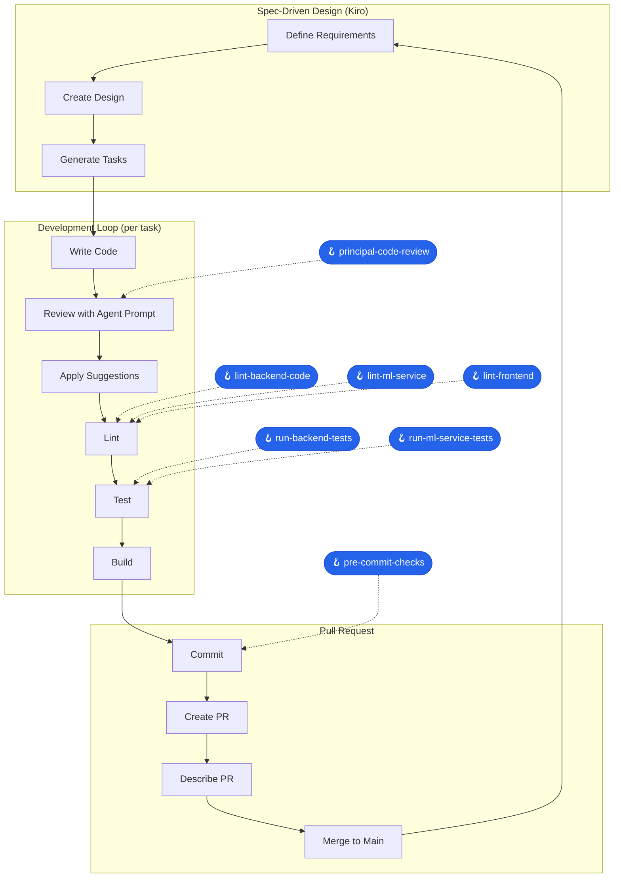

- [Eioku - Video Intelligence Platform](#eioku---video-intelligence-platform)
  - [What It Does](#what-it-does)
  - [Demo Checklist](#demo-checklist)
    - [Limitations](#limitations)
  - [Quick Start with Docker](#quick-start-with-docker)
    - [GPU (CUDA) - Recommended for NVIDIA GPUs](#gpu-cuda---recommended-for-nvidia-gpus)
    - [CPU - For Apple Silicon or systems without NVIDIA GPU](#cpu---for-apple-silicon-or-systems-without-nvidia-gpu)
    - [Stopping and Cleaning Up](#stopping-and-cleaning-up)
    - [Performance Comparison](#performance-comparison)
  - [Architecture](#architecture)
  - [OpenAPI Documentation](#openapi-documentation)
  - [Kiro Usage](#kiro-usage)
    - [Development Workflow](#development-workflow)
    - [Specs (7 features)](#specs-7-features)
    - [Steering (3 rules)](#steering-3-rules)
    - [Hooks (11 automations)](#hooks-11-automations)
    - [Agent Prompt](#agent-prompt)
  - [Related Documentation](#related-documentation)
  - [Contributing](#contributing)

# Eioku - Video Intelligence Platform

Eioku transforms your video library into a searchable database. You film it, we index it, you find it.

---

## What It Does

- **Automatic ML Analysis**: Drop videos in a folder, Eioku automatically runs:
  - Object detection (YOLO) - find every dog, car, person
  - Speech transcription (Whisper) - searchable transcripts
  - OCR (EasyOCR) - text visible in frames
  - Place recognition (Places365) - indoor/outdoor scene classification
  - Scene detection - shot boundary detection
  - Metadata extraction - EXIF timestamps, GPS, duration

- **Cross-Video Search**: Search across your entire library chronologically
  - "Find every dog scene" - jumps between videos automatically
  - Ordered by when you actually filmed (EXIF date), not upload date

- **Global Jump Navigation**: Cmd+F for your video archive
  - Next/Previous buttons navigate across all videos
  - Full-text search on transcripts and OCR text

---

## Demo Checklist

> Hackathon judges: Use the Google Drive videos from the submission, or bring your own!

1. Add videos to `test-videos/` directory (variety: dogs, people, speech, text, GPS)
2. Start the environment using the [Quick Start](#quick-start-with-docker) instructions below
3. Open http://localhost:9080
4. Wait for ML tasks to complete (check status in video player view)
5. Try features:
   - **Video Player**: Explore detected objects, transcripts, OCR, places
   - **Clip Export**: Set timestamps and download a clip
   - **Global Jump**: Search + use Previous/Next to jump across videos
   - **Artifact Gallery**: See all matches with thumbnails

### Limitations

1. **Some ML Models download per boot**: Each time the ml-service reboots, it may download some YOLO models, which will delay processing for up to a minute or so (I missed this during the build process >:|)
2. **Video discovery**: Videos are only discovered when the backend starts - no hot-reload for new files
3. **Face search**: Face detection runs but face search/clustering is not implemented yet
4. **No combined filters**: Global jump searches one artifact type at a time (can't search "dog AND tokyo")
5. **Single language OCR**: OCR is configured for English only
6. **No semantic search**: Text search is exact match only - no embeddings or similarity search yet
7. **Transcription language**: Whisper auto-detects language but works best with English
8. **GPS reverse geocoding**: Requires internet connection for location names
9. **Large video files**: Very long videos (>1hr) may timeout during processing
10. **No search suggestions**: No aggregation of available labels/terms - users must guess what to search for -- you
can view individual videos to get an idea for what does
exist, but it's far from ideal (e.g., no "show me all detected objects or spoken words")

---

## Quick Start with Docker

> Important: the ml-service image is very large due to containing
> ML models (~10GB). It may take a while to pull depending on your
> network.

> Important: the images are only built for `amd64`, so expect
> slower performance on Apple Silicon + Rosetta2.

Two deployment options are available depending on your hardware:

### GPU (CUDA) - Recommended for NVIDIA GPUs

For systems with NVIDIA GPUs and the [NVIDIA Container Toolkit](https://docs.nvidia.com/datacenter/cloud-native/container-toolkit/install-guide.html) installed:

```bash
# Start with GPU acceleration (~10x faster ML processing)
docker compose -f docker/docker-compose.cuda.yml up

# Access the app
open http://localhost:9080
```

### CPU - For Apple Silicon or systems without NVIDIA GPU

For Mac (Apple Silicon), Windows without NVIDIA GPU, or Linux without CUDA:

```bash
# Start with CPU-only processing (slower but universal)
docker compose -f docker/docker-compose.cpu.yml up

# Access the app
open http://localhost:9080
```

> **Note for Apple Silicon users**: Use the CPU environment. The CUDA environment requires NVIDIA GPUs which are not available on Apple hardware. MPS is not supported in docker containers, and I did not have time to create a non-docker environment for the demo.

### Stopping and Cleaning Up

```bash
# Stop the environment
docker compose -f docker/docker-compose.cuda.yml down
docker compose -f docker/docker-compose.cpu.yml down

# Stop and remove all data (fresh start)
docker compose -f docker/docker-compose.cuda.yml down -v
docker compose -f docker/docker-compose.cpu.yml down -v
```

### Performance Comparison

Benchmark on 13 test videos (557 MB total, 2.5-275 MB each):

| Environment | Hardware | Tasks | Duration | Rate |
|-------------|----------|-------|----------|------|
| Docker CUDA | RTX 3070 Ti (8GB) | 130 | 9 min 9 sec | ~14.2 tasks/min |
| Docker CPU | Ryzen 9 5900X | 80 | 1 hr 7 min | ~1.2 tasks/min |

GPU is roughly **10-12x faster** than CPU for ML processing.

---

## Architecture

```
┌─────────────┐     ┌─────────────┐     ┌─────────────┐
│   Frontend  │────▶│  API Service│────▶│  PostgreSQL │
│   (React)   │     │  (FastAPI)  │     │   (JSONB)   │
└─────────────┘     └──────┬──────┘     └──────▲──────┘
                           │                   │
                    ┌──────▼──────┐            │
                    │    Redis    │            │
                    │   (Valkey)  │            │
                    └──────┬──────┘            │
                           │                   │
                    ┌──────▼──────┐            │
                    │ ML Service  │────────────┘
                    │ (GPU/arq)   │  writes artifacts
                    └─────────────┘
```

See [changes.md](./docs/changes.md) for full C4 diagrams and architecture evolution.

---

## OpenAPI Documentation

When running locally:

> Note: this is when using the compose files under the [docker](./docker/) folder.
> For developing, see: [Contributing](#contributing).

- **Swagger UI**: http://localhost:9080/api/docs
- **ReDoc**: http://localhost:9080/api/redoc
- **OpenAPI JSON**: http://localhost:9080/api/openapi.json

## Kiro Usage

This project extensively uses Kiro's spec-driven development workflow and automation features.

### Development Workflow



### Specs (7 features)

> Note: the architecture for this project evolved a lot as I made progress. Review
> those changes here: [Architecture Evolution](./changes.md).

Each feature was designed using Kiro's requirements → design → tasks workflow.
I made extensive use of the [principal-software-engineer.agent](.kiro/prompts/principal-software-engineer.agent.md) for software architecture decisions
and code reviews.

| Spec | Description |
|------|-------------|
| `artifact-envelope-architecture` | Unified artifact storage model with schema registry, projections, and selection policies |
| `global-jump-navigation` | Cross-video search and navigation API using global timeline ordering |
| `global-jump-navigation-gui` | Frontend UI for global jump with search controls |
| `artifact-thumbnails-gallery` | Thumbnail extraction task and gallery search API/UI |
| `worker-ml-service-separation` | Split monolith into API, Worker, and ML services with Redis job queue |
| `video-metadata-extraction` | EXIF metadata extraction and GPS location handling |
| `semantic-video-search` | Core video search and artifact query functionality |

### Steering (3 rules)

Always-on guidance for consistent development:

- `development-principles.md` - Incremental commits, approval workflow, conventional commits, quality gates
- `fastapi-dev-environment.md` - FastAPI best practices, async-first, Pydantic everywhere, container-first dev
- `trunk-based-development.md` - Short-lived branches, small PRs, CI/CD integration

### Hooks (11 automations)

User-triggered commands for common workflows:

| Hook | Action |
|------|--------|
| `start-dev-env` | Start Docker dev environment |
| `stop-dev-env` | Stop Docker dev environment |
| `reset-database` | Reset PostgreSQL and restart services |
| `lint-backend-code` | Run Ruff on backend |
| `lint-ml-service` | Run Ruff on ml-service |
| `lint-frontend` | Run ESLint on frontend |
| `run-backend-tests` | Run pytest on backend |
| `run-ml-service-tests` | Run pytest on ml-service |
| `pre-commit-checks` | Full lint + test + commit workflow |
| `principal-code-review` | AI code review using principal engineer agent |

### Agent Prompt

- `principal-software-engineer.agent.md` - Expert-level engineering guidance for code reviews, focusing on design patterns, SOLID principles, testing strategy, and technical debt management with GitHub issue creation

## Related Documentation

- [Architecture Evolution](./changes.md) - C4 diagrams, trade-offs, phases
- [Development Log](./DEVLOG.md) - Timeline, decisions, challenges
- [Attribution](./ATTRIBUTION.md) - Third-party libraries
- [Presentation Script](./presentation-script.md) - Demo video script

## Contributing

See: [CONTRIBUTING](./CONTRIBUTING.md).
