# Eioku Architecture Evolution

This document chronicles the architectural journey of the Eioku video intelligence platform, including C4 diagrams, key trade-offs, and lessons learned.

---

## Table of Contents

1. [Executive Summary](#executive-summary)
2. [Architecture Phases](#architecture-phases)
3. [C4 Diagrams](#c4-diagrams)
4. [Key Trade-offs](#key-trade-offs)
5. [Data Flow Evolution](#data-flow-evolution)
6. [Lessons Learned](#lessons-learned)

---

## Executive Summary

Eioku evolved from a monolithic video processing application to a distributed, GPU-aware microservices architecture over ~109 commits. The transformation addressed:

- **Scalability**: Separating GPU-bound ML inference from API coordination
- **Flexibility**: Unified artifact storage supporting multiple ML model versions
- **Discoverability**: Cross-video search and navigation across entire video libraries
- **Maintainability**: Domain-driven design with clear service boundaries

---

## Architecture Phases

### Phase 0: Initial Monolith (Pre-Refactor)

**Problem Statement**: Single backend service handling everything—API requests, ML inference, database operations, and video processing.

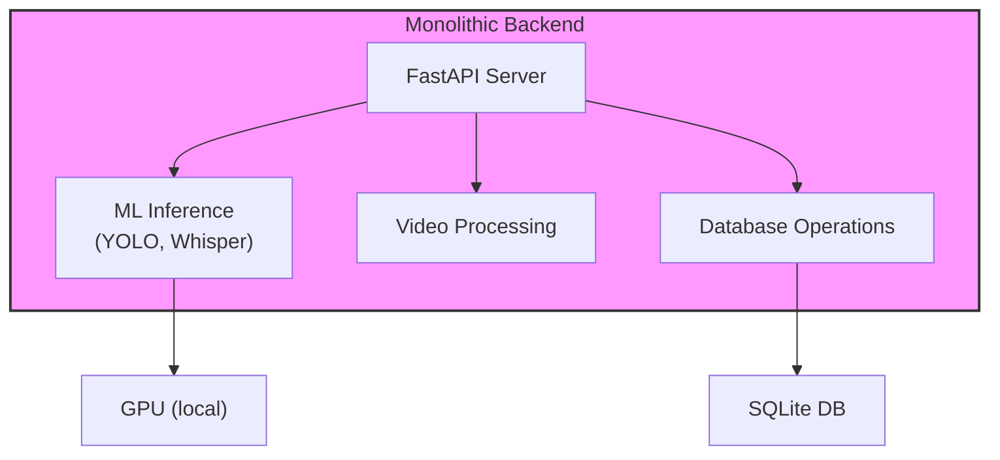
```mermaid
graph TB
    subgraph Monolith["Monolithic Backend"]
        API["FastAPI Server"]
        ML["ML Inference<br/>(YOLO, Whisper)"]
        VP["Video Processing"]
        DB_OPS["Database Operations"]
    end

    API --> ML
    API --> VP
    API --> DB_OPS

    ML --> GPU["GPU (local)"]
    DB_OPS --> SQLite["SQLite DB"]

    style Monolith fill:#f9f,stroke:#333,stroke-width:2px
```

**Issues**:
- ML inference blocked API requests
- GPU memory contention
- Difficult to scale horizontally
- New ML models required new database tables
- No unified artifact versioning
- Cannot write the SQLite concurrently (multiple workers)
- Individual database schemas resulted in sprawl in code to support each
  data model (supporting different versions of ML models, or adding new types
  of ML model responses becomes a migration nightmare)

---

### Phase 1: Artifact Envelope Architecture (PR #01 - 23 commits)

**Goal**: Unified storage model for all ML outputs with schema versioning.

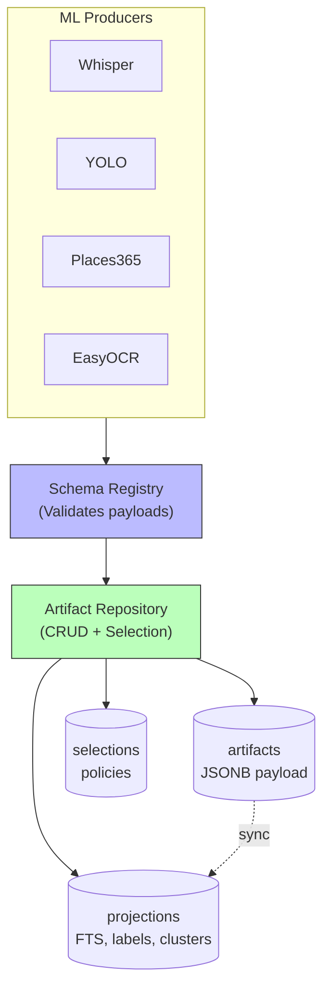
```mermaid
graph TB
    subgraph Producers["ML Producers"]
        Whisper["Whisper"]
        YOLO["YOLO"]
        Places["Places365"]
        OCR["EasyOCR"]
    end

    Producers --> SR["Schema Registry<br/>(Validates payloads)"]
    SR --> AR["Artifact Repository<br/>(CRUD + Selection)"]

    AR --> Artifacts[(artifacts<br/>JSONB payload)]
    AR --> Projections[(projections<br/>FTS, labels, clusters)]
    AR --> Selections[(selections<br/>policies)]

    Artifacts -.->|sync| Projections

    style SR fill:#bbf,stroke:#333
    style AR fill:#bfb,stroke:#333
```

**Database Schema**:

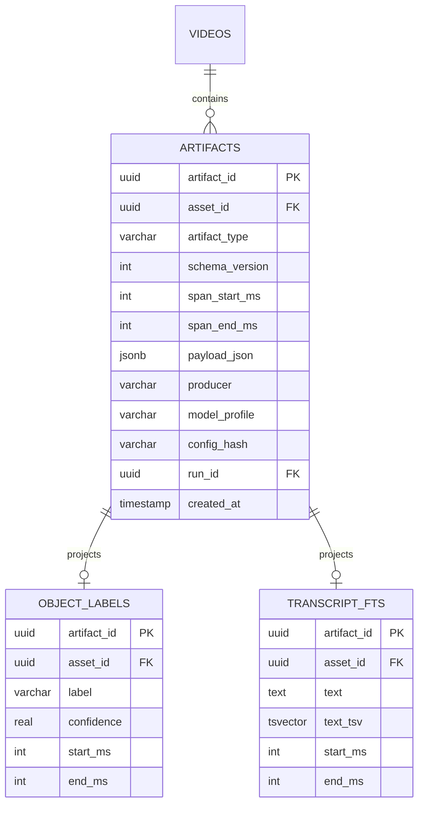
```mermaid
erDiagram
    ARTIFACTS {
        uuid artifact_id PK
        uuid asset_id FK
        varchar artifact_type
        int schema_version
        int span_start_ms
        int span_end_ms
        jsonb payload_json
        varchar producer
        varchar model_profile
        varchar config_hash
        uuid run_id FK
        timestamp created_at
    }

    OBJECT_LABELS {
        uuid artifact_id PK
        uuid asset_id FK
        varchar label
        real confidence
        int start_ms
        int end_ms
    }

    TRANSCRIPT_FTS {
        uuid artifact_id PK
        uuid asset_id FK
        text text
        tsvector text_tsv
        int start_ms
        int end_ms
    }

    VIDEOS ||--o{ ARTIFACTS : contains
    ARTIFACTS ||--o| OBJECT_LABELS : projects
    ARTIFACTS ||--o| TRANSCRIPT_FTS : projects
```

**Key Decisions**:

| Decision | Options Considered | Chosen | Rationale |
|----------|-------------------|--------|-----------|
| Storage format | Separate tables per type vs JSONB | JSONB | Eliminates "new artifact tax", flexible schema evolution |
| Projections | Views vs materialized tables | Materialized tables with triggers | Better query performance, FTS support |
| Selection | Always latest vs configurable | Configurable policies | Supports pinning, profiles, experimentation |

---

### Phase 2: ML Service Separation (PR #02 - 27 commits)

**Goal**: Extract GPU-bound ML inference into a dedicated service.

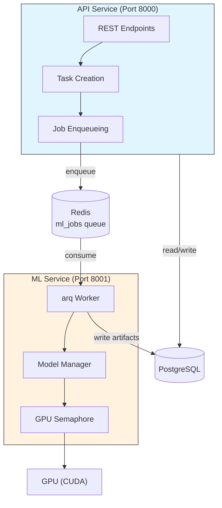
```mermaid
graph TB
    subgraph API["API Service (Port 8000)"]
        REST["REST Endpoints"]
        TaskMgmt["Task Creation"]
        JobEnqueue["Job Enqueueing"]
    end

    subgraph ML["ML Service (Port 8001)"]
        Worker["arq Worker"]
        ModelMgr["Model Manager"]
        GPUSem["GPU Semaphore"]
    end

    REST --> TaskMgmt
    TaskMgmt --> JobEnqueue
    JobEnqueue -->|enqueue| Redis[(Redis<br/>ml_jobs queue)]

    Redis -->|consume| Worker
    Worker --> ModelMgr
    ModelMgr --> GPUSem
    GPUSem --> GPU["GPU (CUDA)"]

    Worker -->|write artifacts| Postgres[(PostgreSQL)]

    API -->|read/write| Postgres

    style API fill:#e1f5fe,stroke:#333
    style ML fill:#fff3e0,stroke:#333
```

**Model Manager Design**:

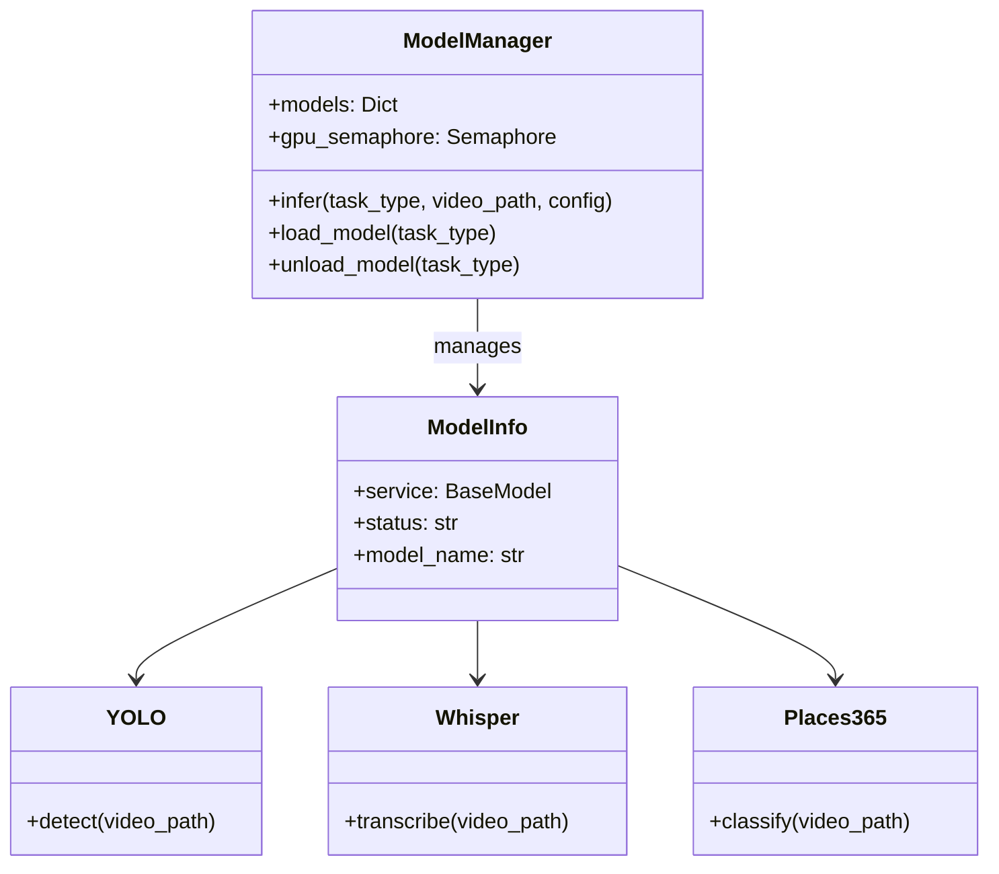
```mermaid
classDiagram
    class ModelManager {
        +models: Dict
        +gpu_semaphore: Semaphore
        +infer(task_type, video_path, config)
        +load_model(task_type)
        +unload_model(task_type)
    }

    class ModelInfo {
        +service: BaseModel
        +status: str
        +model_name: str
    }

    ModelManager --> ModelInfo : manages

    class YOLO {
        +detect(video_path)
    }
    class Whisper {
        +transcribe(video_path)
    }
    class Places365 {
        +classify(video_path)
    }

    ModelInfo --> YOLO
    ModelInfo --> Whisper
    ModelInfo --> Places365
```

---

### Phase 3: Worker-ML Service Complete Separation (PR #03 - 34 commits)

**Goal**: Full service isolation with reconciliation and task management.

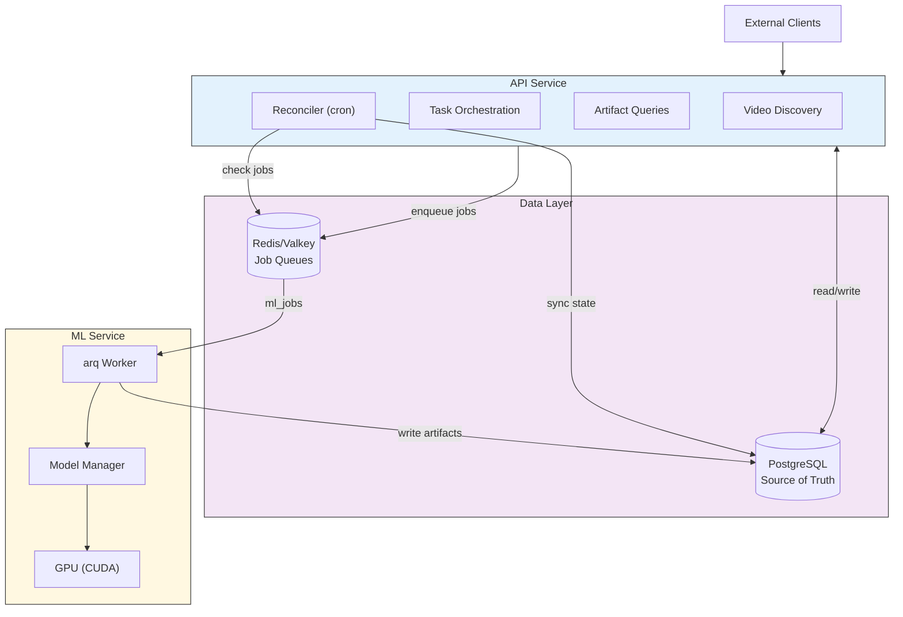
```mermaid
graph TB
    Client["External Clients"] --> API

    subgraph API["API Service"]
        VideoDisc["Video Discovery"]
        TaskOrch["Task Orchestration"]
        ArtifactQ["Artifact Queries"]
        Reconciler["Reconciler (cron)"]
    end

    subgraph Storage["Data Layer"]
        Postgres[(PostgreSQL<br/>Source of Truth)]
        Redis[(Redis/Valkey<br/>Job Queues)]
    end

    subgraph MLService["ML Service"]
        ARQWorker["arq Worker"]
        Models["Model Manager"]
        GPU["GPU (CUDA)"]
    end

    API <-->|read/write| Postgres
    API -->|enqueue jobs| Redis

    Redis -->|ml_jobs| ARQWorker
    ARQWorker --> Models
    Models --> GPU
    ARQWorker -->|write artifacts| Postgres

    Reconciler -->|sync state| Postgres
    Reconciler -->|check jobs| Redis

    style API fill:#e3f2fd,stroke:#333
    style MLService fill:#fff8e1,stroke:#333
    style Storage fill:#f3e5f5,stroke:#333
```

**Reconciliation Flow**:

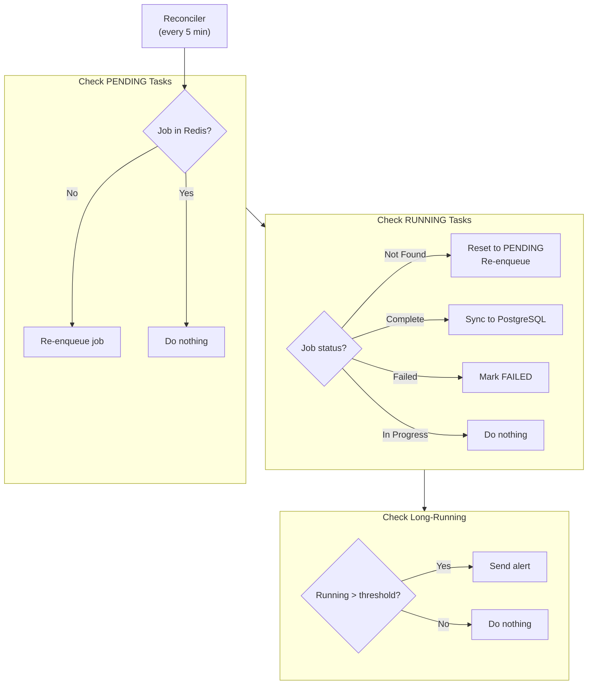
```mermaid
flowchart TB
    Start["Reconciler<br/>(every 5 min)"] --> CheckPending

    subgraph Pending["Check PENDING Tasks"]
        CheckPending{Job in Redis?}
        CheckPending -->|No| ReEnqueue1["Re-enqueue job"]
        CheckPending -->|Yes| Skip1["Do nothing"]
    end

    subgraph Running["Check RUNNING Tasks"]
        CheckRunning{Job status?}
        CheckRunning -->|Not Found| Reset["Reset to PENDING<br/>Re-enqueue"]
        CheckRunning -->|Complete| SyncComplete["Sync to PostgreSQL"]
        CheckRunning -->|Failed| SyncFailed["Mark FAILED"]
        CheckRunning -->|In Progress| Skip2["Do nothing"]
    end

    subgraph LongRunning["Check Long-Running"]
        CheckLong{Running > threshold?}
        CheckLong -->|Yes| Alert["Send alert"]
        CheckLong -->|No| Skip3["Do nothing"]
    end

    Pending --> Running
    Running --> LongRunning
```

---

### Phase 4: Frontend & Metadata Extraction (PR #04 - 25 commits)

**Goal**: User-facing components and video metadata pipeline.

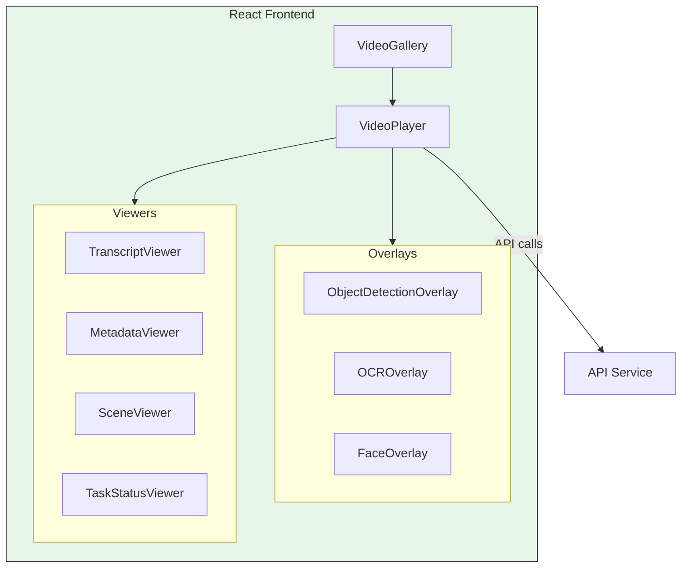
```mermaid
graph TB
    subgraph Frontend["React Frontend"]
        Gallery["VideoGallery"]
        Player["VideoPlayer"]

        subgraph Overlays["Overlays"]
            ObjOverlay["ObjectDetectionOverlay"]
            OCROverlay["OCROverlay"]
            FaceOverlay["FaceOverlay"]
        end

        subgraph Viewers["Viewers"]
            Transcript["TranscriptViewer"]
            Metadata["MetadataViewer"]
            Scene["SceneViewer"]
            Task["TaskStatusViewer"]
        end
    end

    Gallery --> Player
    Player --> Overlays
    Player --> Viewers

    Player -->|API calls| Backend["API Service"]

    style Frontend fill:#e8f5e9,stroke:#333
```

**Metadata Extraction Pipeline**:

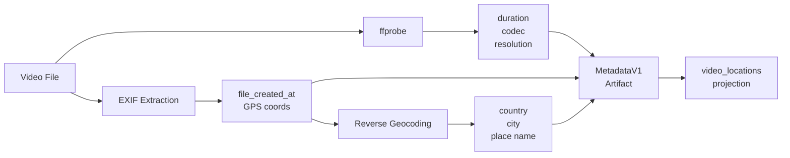
```mermaid
flowchart LR
    Video["Video File"] --> FFProbe["ffprobe"]
    Video --> EXIF["EXIF Extraction"]

    FFProbe --> Duration["duration<br/>codec<br/>resolution"]
    EXIF --> FileDate["file_created_at<br/>GPS coords"]

    FileDate --> Geocode["Reverse Geocoding"]
    Geocode --> Location["country<br/>city<br/>place name"]

    Duration --> Artifact["MetadataV1<br/>Artifact"]
    FileDate --> Artifact
    Location --> Artifact

    Artifact --> Projection["video_locations<br/>projection"]
```

---

### Phase 5: Global Jump Navigation (Post-PR4)

**Goal**: Cross-video search and navigation across entire video library.

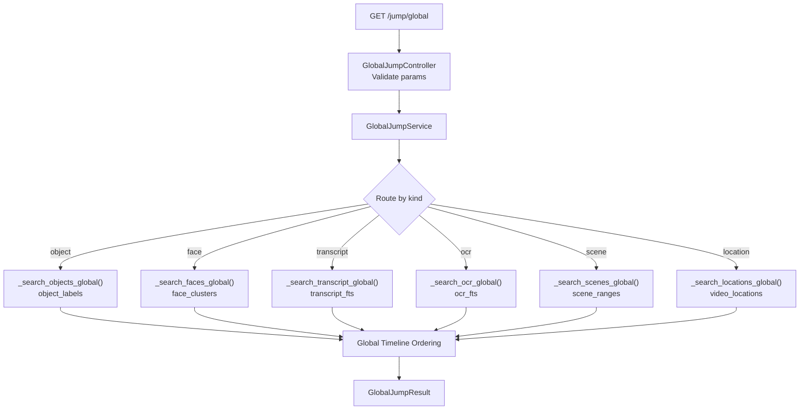
```mermaid
flowchart TB
    Request["GET /jump/global"] --> Controller["GlobalJumpController<br/>Validate params"]

    Controller --> Service["GlobalJumpService"]

    Service --> Router{Route by kind}

    Router -->|object| ObjSearch["_search_objects_global()<br/>object_labels"]
    Router -->|face| FaceSearch["_search_faces_global()<br/>face_clusters"]
    Router -->|transcript| TransSearch["_search_transcript_global()<br/>transcript_fts"]
    Router -->|ocr| OCRSearch["_search_ocr_global()<br/>ocr_fts"]
    Router -->|scene| SceneSearch["_search_scenes_global()<br/>scene_ranges"]
    Router -->|location| LocSearch["_search_locations_global()<br/>video_locations"]

    ObjSearch --> Timeline["Global Timeline Ordering"]
    FaceSearch --> Timeline
    TransSearch --> Timeline
    OCRSearch --> Timeline
    SceneSearch --> Timeline
    LocSearch --> Timeline

    Timeline --> Response["GlobalJumpResult"]
```

**Global Timeline Ordering**:

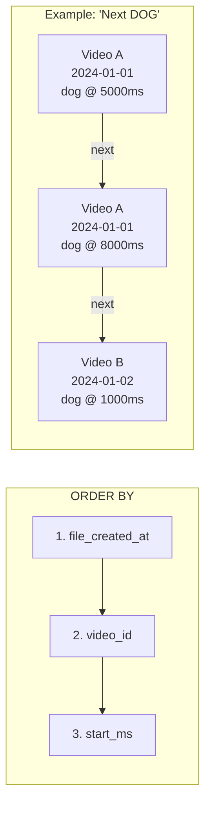
```mermaid
flowchart LR
    subgraph Order["ORDER BY"]
        O1["1. file_created_at"]
        O2["2. video_id"]
        O3["3. start_ms"]
    end

    O1 --> O2 --> O3

    subgraph Example["Example: 'Next DOG'"]
        V1["Video A<br/>2024-01-01<br/>dog @ 5000ms"]
        V2["Video A<br/>2024-01-01<br/>dog @ 8000ms"]
        V3["Video B<br/>2024-01-02<br/>dog @ 1000ms"]
    end

    V1 -->|next| V2 -->|next| V3
```

---

## C4 Diagrams

### Level 1: System Context

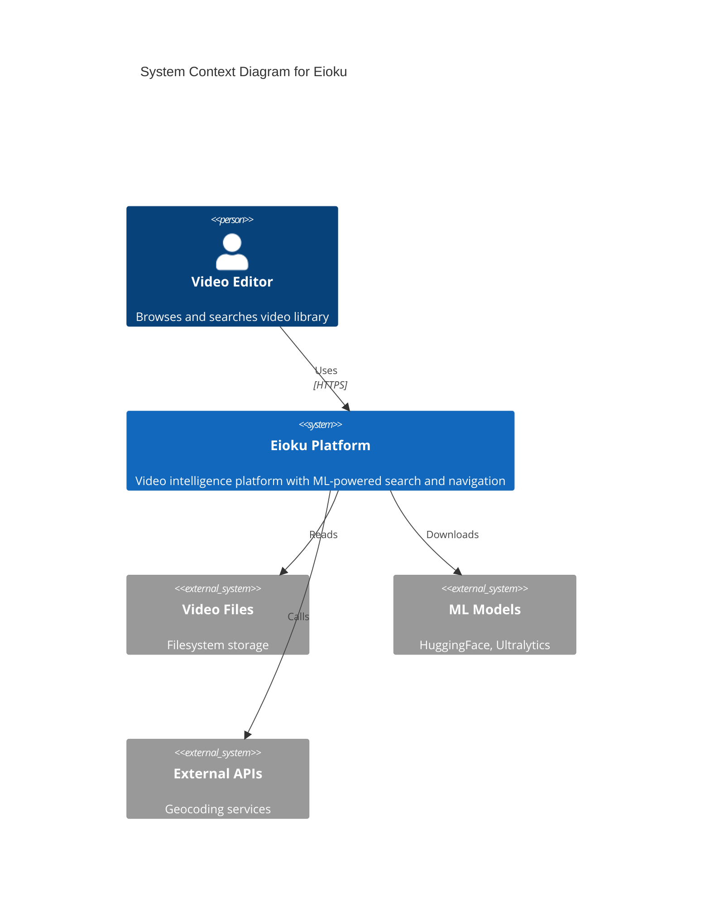
```mermaid
C4Context
    title System Context Diagram for Eioku

    Person(user, "Video Editor", "Browses and searches video library")

    System(eioku, "Eioku Platform", "Video intelligence platform with ML-powered search and navigation")

    System_Ext(files, "Video Files", "Filesystem storage")
    System_Ext(models, "ML Models", "HuggingFace, Ultralytics")
    System_Ext(apis, "External APIs", "Geocoding services")

    Rel(user, eioku, "Uses", "HTTPS")
    Rel(eioku, files, "Reads")
    Rel(eioku, models, "Downloads")
    Rel(eioku, apis, "Calls")
```

### Level 2: Container Diagram

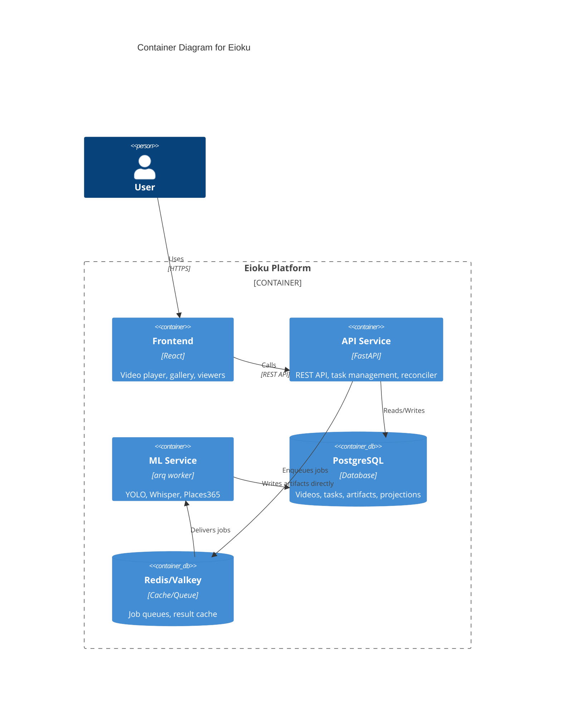
```mermaid
C4Container
    title Container Diagram for Eioku

    Person(user, "User")

    Container_Boundary(eioku, "Eioku Platform") {
        Container(frontend, "Frontend", "React", "Video player, gallery, viewers")
        Container(api, "API Service", "FastAPI", "REST API, task management, reconciler")
        Container(ml, "ML Service", "arq worker", "YOLO, Whisper, Places365")

        ContainerDb(postgres, "PostgreSQL", "Database", "Videos, tasks, artifacts, projections")
        ContainerDb(redis, "Redis/Valkey", "Cache/Queue", "Job queues, result cache")
    }

    Rel(user, frontend, "Uses", "HTTPS")
    Rel(frontend, api, "Calls", "REST API")
    Rel(api, postgres, "Reads/Writes")
    Rel(api, redis, "Enqueues jobs")
    Rel(redis, ml, "Delivers jobs")
    Rel(ml, postgres, "Writes artifacts directly")
```

### Level 3: Component Diagram - API Service

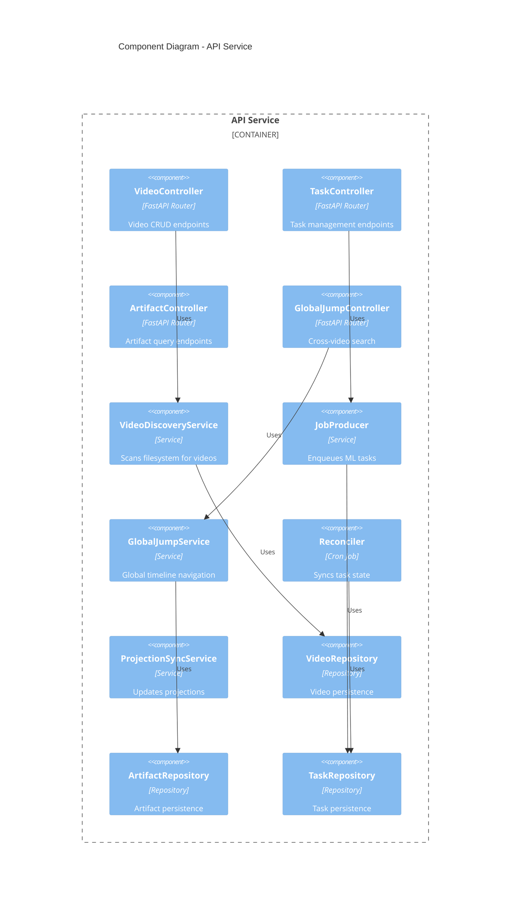
```mermaid
C4Component
    title Component Diagram - API Service

    Container_Boundary(api, "API Service") {
        Component(video_ctrl, "VideoController", "FastAPI Router", "Video CRUD endpoints")
        Component(task_ctrl, "TaskController", "FastAPI Router", "Task management endpoints")
        Component(artifact_ctrl, "ArtifactController", "FastAPI Router", "Artifact query endpoints")
        Component(jump_ctrl, "GlobalJumpController", "FastAPI Router", "Cross-video search")

        Component(discovery, "VideoDiscoveryService", "Service", "Scans filesystem for videos")
        Component(producer, "JobProducer", "Service", "Enqueues ML tasks")
        Component(jump_svc, "GlobalJumpService", "Service", "Global timeline navigation")
        Component(reconciler, "Reconciler", "Cron Job", "Syncs task state")
        Component(projection, "ProjectionSyncService", "Service", "Updates projections")

        Component(video_repo, "VideoRepository", "Repository", "Video persistence")
        Component(artifact_repo, "ArtifactRepository", "Repository", "Artifact persistence")
        Component(task_repo, "TaskRepository", "Repository", "Task persistence")
    }

    Rel(video_ctrl, discovery, "Uses")
    Rel(task_ctrl, producer, "Uses")
    Rel(jump_ctrl, jump_svc, "Uses")

    Rel(discovery, video_repo, "Uses")
    Rel(producer, task_repo, "Uses")
    Rel(jump_svc, artifact_repo, "Uses")
    Rel(reconciler, task_repo, "Uses")
```

### Level 3: Component Diagram - ML Service

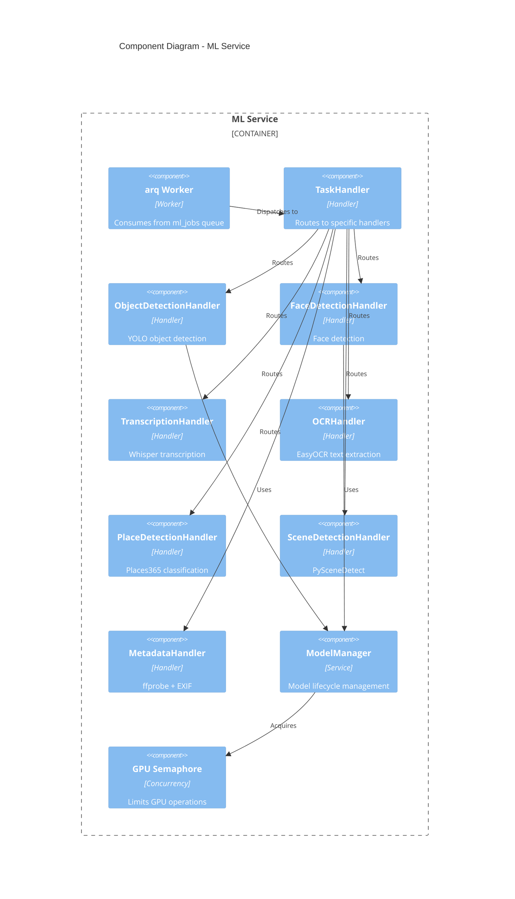
```mermaid
C4Component
    title Component Diagram - ML Service

    Container_Boundary(ml, "ML Service") {
        Component(worker, "arq Worker", "Worker", "Consumes from ml_jobs queue")
        Component(handler, "TaskHandler", "Handler", "Routes to specific handlers")

        Component(obj_handler, "ObjectDetectionHandler", "Handler", "YOLO object detection")
        Component(face_handler, "FaceDetectionHandler", "Handler", "Face detection")
        Component(trans_handler, "TranscriptionHandler", "Handler", "Whisper transcription")
        Component(ocr_handler, "OCRHandler", "Handler", "EasyOCR text extraction")
        Component(place_handler, "PlaceDetectionHandler", "Handler", "Places365 classification")
        Component(scene_handler, "SceneDetectionHandler", "Handler", "PySceneDetect")
        Component(meta_handler, "MetadataHandler", "Handler", "ffprobe + EXIF")

        Component(model_mgr, "ModelManager", "Service", "Model lifecycle management")
        Component(gpu_sem, "GPU Semaphore", "Concurrency", "Limits GPU operations")
    }

    Rel(worker, handler, "Dispatches to")
    Rel(handler, obj_handler, "Routes")
    Rel(handler, face_handler, "Routes")
    Rel(handler, trans_handler, "Routes")
    Rel(handler, ocr_handler, "Routes")
    Rel(handler, place_handler, "Routes")
    Rel(handler, scene_handler, "Routes")
    Rel(handler, meta_handler, "Routes")

    Rel(obj_handler, model_mgr, "Uses")
    Rel(face_handler, model_mgr, "Uses")
    Rel(model_mgr, gpu_sem, "Acquires")
```

---

## Key Trade-offs

### 1. JSONB vs Separate Tables for Artifacts

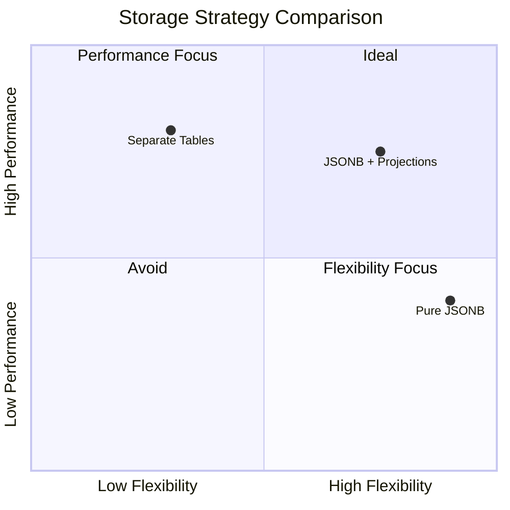
```mermaid
quadrantChart
    title Storage Strategy Comparison
    x-axis Low Flexibility --> High Flexibility
    y-axis Low Performance --> High Performance
    quadrant-1 Ideal
    quadrant-2 Performance Focus
    quadrant-3 Avoid
    quadrant-4 Flexibility Focus

    "Separate Tables": [0.3, 0.8]
    "Pure JSONB": [0.9, 0.4]
    "JSONB + Projections": [0.75, 0.75]
```

| Factor | JSONB (Chosen) | Separate Tables |
|--------|---------------|-----------------|
| **Flexibility** | High - schema changes don't require migrations | Low - each change needs ALTER TABLE |
| **Query Performance** | Moderate - GIN indexes help | High - native indexing |
| **New Artifact Tax** | None - just add schema version | High - new table, migrations, ORM models |
| **Type Safety** | Runtime validation via Pydantic | Compile-time via ORM |

**Decision**: JSONB with projection tables. Get flexibility of JSONB for canonical storage, performance of native tables for queries.

### 2. Redis Queue vs HTTP for ML Service

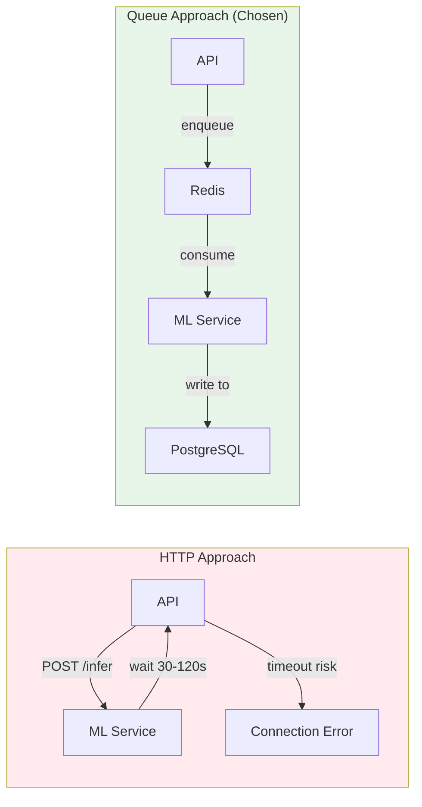
```mermaid
flowchart LR
    subgraph HTTP["HTTP Approach"]
        A1["API"] -->|POST /infer| A2["ML Service"]
        A2 -->|wait 30-120s| A1
        A1 -->|timeout risk| X1["Connection Error"]
    end

    subgraph Queue["Queue Approach (Chosen)"]
        B1["API"] -->|enqueue| B2["Redis"]
        B2 -->|consume| B3["ML Service"]
        B3 -->|write to| B4["PostgreSQL"]
    end

    style Queue fill:#e8f5e9
    style HTTP fill:#ffebee
```

| Factor | Redis Queue (Chosen) | Direct HTTP |
|--------|---------------------|-------------|
| **Timeout Handling** | Natural - no HTTP timeout | Complex - needs long timeouts |
| **Retry Logic** | Built into arq | Manual implementation |
| **Backpressure** | Automatic queuing | Connection exhaustion |

### 3. Projection Tables vs Materialized Views

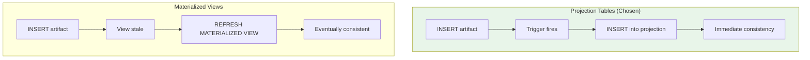
```mermaid
flowchart TB
    subgraph Projections["Projection Tables (Chosen)"]
        P1["INSERT artifact"] --> P2["Trigger fires"]
        P2 --> P3["INSERT into projection"]
        P3 --> P4["Immediate consistency"]
    end

    subgraph MatViews["Materialized Views"]
        M1["INSERT artifact"] --> M2["View stale"]
        M2 --> M3["REFRESH MATERIALIZED VIEW"]
        M3 --> M4["Eventually consistent"]
    end

    style Projections fill:#e8f5e9
```

| Factor | Projection Tables (Chosen) | Materialized Views |
|--------|---------------------------|-------------------|
| **Update Control** | Explicit via triggers | REFRESH command |
| **Partial Updates** | Supported | Full refresh only |
| **Staleness** | Real-time sync | Potentially stale |

---

## Data Flow Evolution

### Before: Synchronous Processing

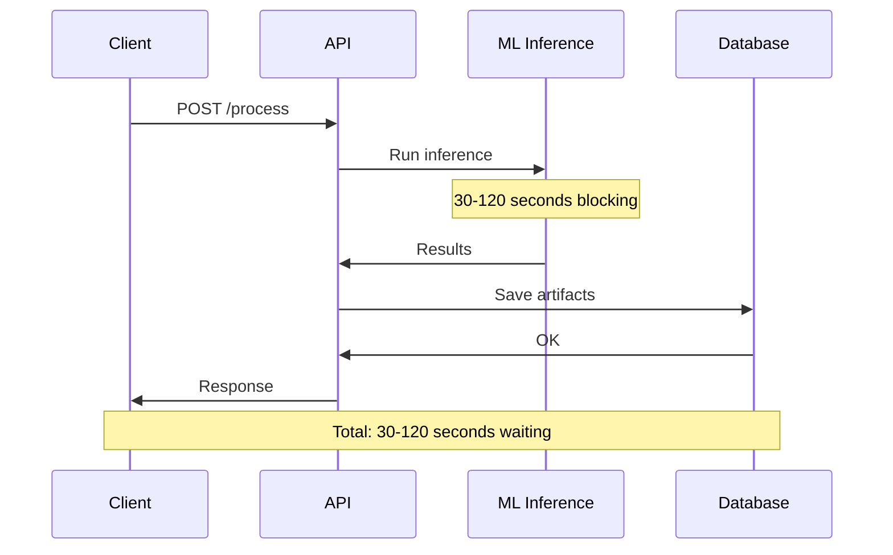
```mermaid
sequenceDiagram
    participant Client
    participant API
    participant ML as ML Inference
    participant DB as Database

    Client->>API: POST /process
    API->>ML: Run inference
    Note over ML: 30-120 seconds blocking
    ML->>API: Results
    API->>DB: Save artifacts
    DB->>API: OK
    API->>Client: Response

    Note over Client,DB: Total: 30-120 seconds waiting
```

### After: Async Queue-Based Processing

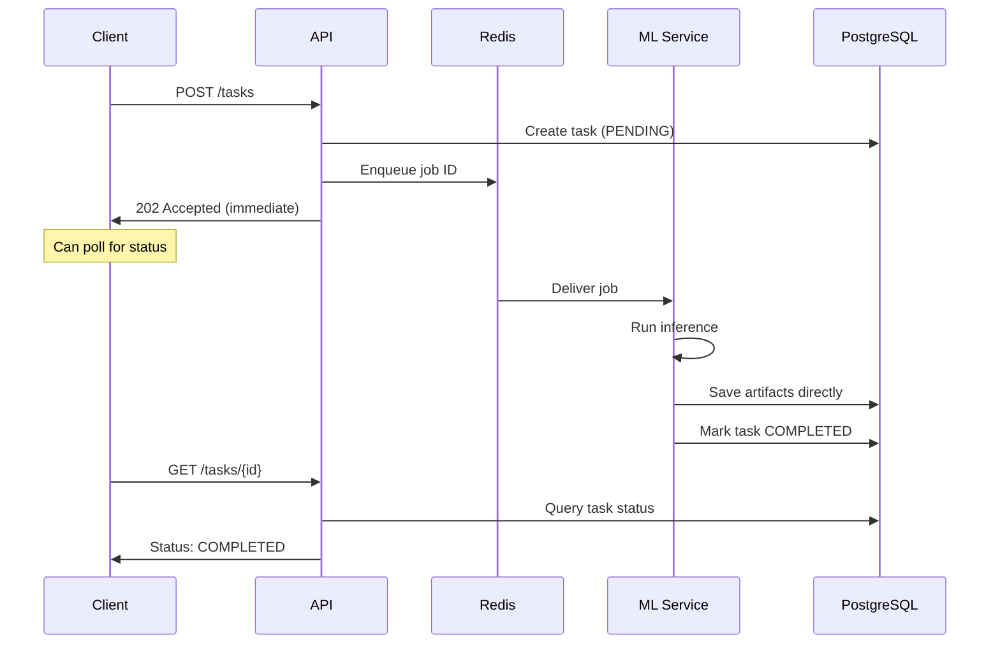
```mermaid
sequenceDiagram
    participant Client
    participant API
    participant Redis
    participant ML as ML Service
    participant DB as PostgreSQL

    Client->>API: POST /tasks
    API->>DB: Create task (PENDING)
    API->>Redis: Enqueue job ID
    API->>Client: 202 Accepted (immediate)

    Note over Client: Can poll for status

    Redis->>ML: Deliver job
    ML->>ML: Run inference
    ML->>DB: Save artifacts directly
    ML->>DB: Mark task COMPLETED

    Client->>API: GET /tasks/{id}
    API->>DB: Query task status
    API->>Client: Status: COMPLETED
```

---

## Lessons Learned

### 1. Schema Versioning is Critical

```mermaid
flowchart LR
    subgraph Before["Before"]
        B1["artifact_v1"] --> B2["Breaking change"]
        B2 --> B3["Migration nightmare"]
    end

    subgraph After["After"]
        A1["artifact v1"] --> A2["Add v2 schema"]
        A2 --> A3["Both coexist"]
        A3 --> A4["Graceful migration"]
    end

    style Before fill:#ffebee
    style After fill:#e8f5e9
```

### 2. PostgreSQL as Source of Truth

```mermaid
flowchart TB
    subgraph Problem["Problem: Redis Crash"]
        R1["Redis loses jobs"] --> R2["Tasks stuck RUNNING"]
        R2 --> R3["Manual intervention"]
    end

    subgraph Solution["Solution: Reconciler"]
        S1["PostgreSQL = truth"] --> S2["Reconciler checks Redis"]
        S2 --> S3["Re-enqueue missing jobs"]
        S3 --> S4["Automatic recovery"]
    end

    style Problem fill:#ffebee
    style Solution fill:#e8f5e9
```

### 3. GPU Memory Management

```mermaid
flowchart TB
    subgraph Problem["Problem"]
        P1["Model A loads"] --> P2["Model B loads"]
        P2 --> P3["OOM Error"]
    end

    subgraph Solution["Solution"]
        S1["GPU Semaphore<br/>(concurrency=2)"]
        S2["Request 1"] --> S1
        S3["Request 2"] --> S1
        S4["Request 3"] -->|wait| S1
        S1 --> S5["Controlled access"]
    end

    style Problem fill:#ffebee
    style Solution fill:#e8f5e9
```

---

## Future Considerations

### Planned Enhancements

```mermaid
timeline
    title Eioku Roadmap

    Phase 6 : Embedding Search
           : pgvector for similarity
           : CLIP embeddings
           : Face similarity

    Phase 7 : Multi-Filter Queries
           : AND/OR logic
           : Combined searches

    Phase 8 : Geo-Spatial
           : PostGIS integration
           : Location-based search

    Phase 9 : Performance
           : Materialized views
           : Query caching
           : Table partitioning
```

### Technical Debt

1. Remove `backend/out.json` from git history (18MB debug artifact)
2. Consolidate duplicate database models between services
3. Add comprehensive integration tests for Reconciler
4. Document API versioning strategy

---

*Generated: 2026-01-29*
*Commits Analyzed: 109 (PR branches)*
*Design Docs: .kiro/specs/*
